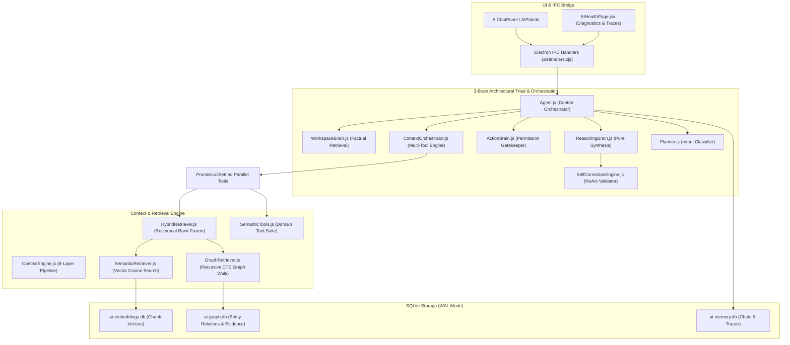

# Notely AI Platform — Comprehensive AI & Agent Subsystem Architecture

This directory contains the codebase for Notely's local-first, modular AI platform. Markdown notes remain the single source of truth, parsed and indexed into offline-first SQLite databases (`ai-embeddings.db`, `ai-graph.db`, `ai-memory.db`).

---

## AI Platform Overview & Design Philosophy

Notely's AI is engineered as an **intelligent knowledge companion** rather than a generic LLM chatbot wrapper.

### Core Guiding Principles:
1. **Human-like & Natural**: Speaks like a knowledgeable pair programmer and workspace teammate. Never exposes internal technical mechanics (`"search_notes"`, `"vector similarity"`, `"knowledge graph nodes"`).
2. **Context-Aware & Grounded**: Proactively retrieves workspace facts before generating answers. All claims are grounded in verified note file links (`[file.md](file:///path)`).
3. **Multi-Tool Planning & Orchestration**: Dynamically executes parallel retrievals, chains tool outputs, and evaluates evidence confidence before answer synthesis.
4. **Strict Note Immutability**: Existing notes are **100% read-only**. AI tools cannot update, edit, move, rename, or delete existing user notes under any circumstances.
5. **Local-First & Provider Agnostic**: Leverages local ONNX embeddings (`BGE-small-en-v1.5`) and background worker processes (`utilityProcess`), while supporting Gemini, Groq, OpenAI, and Local GGUF models.

---

## Complete 3-Brain Subsystem Architecture



---

## Subsystem Component Reference

### 1. 3-Brain Architectural Triad & Orchestrator

| Component | File Path | Architectural Responsibility | Key Safeguards & Capabilities |
|---|---|---|---|
| **ContextOrchestrator** | [`ai/core/ContextOrchestrator.js`](file:///c:/Users/oksbw/OneDrive/Desktop/Antigravity%20Workspace/Notely/ai/core/ContextOrchestrator.js) | Multi-Tool Planning & Context Aggregation | Runs parallel tool execution (`Promise.allSettled`), output chaining, evidence deduplication, and confidence looping. |
| **WorkspaceBrain** | [`ai/core/WorkspaceBrain.js`](file:///c:/Users/oksbw/OneDrive/Desktop/Antigravity%20Workspace/Notely/ai/core/WorkspaceBrain.js) | Factual Retrieval & Context Aggregation | Proactively gathers active note text, vector similarity matches, and graph hops for every query. |
| **ReasoningBrain** | [`ai/core/ReasoningBrain.js`](file:///c:/Users/oksbw/OneDrive/Desktop/Antigravity%20Workspace/Notely/ai/core/ReasoningBrain.js) | Analytical Reasoning & Synthesis | Synthesizes natural human responses. Has **zero direct access to disk or SQLite**. |
| **ActionBrain** | [`ai/core/ActionBrain.js`](file:///c:/Users/oksbw/OneDrive/Desktop/Antigravity%20Workspace/Notely/ai/core/ActionBrain.js) | Permission Gatekeeper & Execution Safety | Permanently blocks `update_note`, `delete_note`, `move_note`, `rename_note`. Rejects file overwrites on `create_note`. |

### 2. Planning & Tool Ecosystem

| Component | File Path | Responsibility | Capabilities |
|---|---|---|---|
| **Planner** | [`ai/core/Planner.js`](file:///c:/Users/oksbw/OneDrive/Desktop/Antigravity%20Workspace/Notely/ai/core/Planner.js) | Intent Classification & Planning | Classifies query intent (`DirectQuery`, `TopicExploration`, `TimelineReconstruction`, `TaskSummary`) and generates internal plan graphs. |
| **SemanticTools** | [`ai/tools/SemanticTools.js`](file:///c:/Users/oksbw/OneDrive/Desktop/Antigravity%20Workspace/Notely/ai/tools/SemanticTools.js) | High-Level Domain Tools | Exposes `find_discussions`, `find_architecture`, `find_people_and_tasks`, `reconstruct_timeline`, `explore_topic_graph`. |

### 3. Prompting, Persona & Grounding System

| Component | File Path | Responsibility | Features |
|---|---|---|---|
| **PromptLibrary** | [`ai/core/PromptLibrary.js`](file:///c:/Users/oksbw/OneDrive/Desktop/Antigravity%20Workspace/Notely/ai/core/PromptLibrary.js) | Modular System Prompts | Assembles base policies, dynamic domain context inference, active persona instructions, and workspace context. |
| **GroundingEngine** | [`ai/core/GroundingEngine.js`](file:///c:/Users/oksbw/OneDrive/Desktop/Antigravity%20Workspace/Notely/ai/core/GroundingEngine.js) | Citation Link Validator | Audits file link citations (`[label](file:///path)`) against disk and strips broken links before response output. |
| **SelfCorrectionEngine**| [`ai/core/SelfCorrectionEngine.js`](file:///c:/Users/oksbw/OneDrive/Desktop/Antigravity%20Workspace/Notely/ai/core/SelfCorrectionEngine.js) | ReAct Response Validation Pass | Intercepts draft responses, strips leaked technical tool narration jargon, and validates grounding. |

---

## Multi-Tool Planning & Context Orchestration

`ContextOrchestrator.js` implements an autonomous evidence-gathering workflow:

1. **Internal Intent & Plan Generation**: `Planner.js` creates candidate retrieval steps based on query classification (`DirectQuery`, `TopicExploration`, `TimelineReconstruction`, `TaskSummary`). The plan is strictly internal and never exposed to the user.
2. **Parallel & Chained Tool Execution**: Independent semantic tools (`find_discussions`, `explore_topic_graph`, `find_architecture`) execute concurrently using `Promise.allSettled`. Outputs chain into subsequent retrieval steps.
3. **Context Aggregation & Consolidation**:
   - Evidence deduplication across tools and vector chunks.
   - Relevance score ranking and source file attribution (`[file.md](file:///path)`).
   - Trace telemetry collection (`executionTrace`) capturing all graph hops, tool parameters, and execution outputs for the UI **AI Health & Diagnostics** page (`AIHealthPage.jsx`).
4. **Confidence Evaluation Loop**: Measures overall evidence confidence ($0.0 - 1.0$). If confidence $< 0.70$ and iterations $< 3$, performs additional graph expansion or discussion lookups.
5. **Curated Handoff**: Supplies consolidated evidence payload to `ReasoningBrain.js` for answer synthesis.

---

## Verification & Test Suite Execution

All AI subsystem components are covered by Vitest test suites under `tests/ai/`:

```bash
node node_modules/vitest/vitest.mjs run tests/ai
```

### Test Suite Map (27 Test Files / 72 Tests Passing 100%):
- `tests/ai/orchestrator.spec.js`: Multi-tool planning, parallel retrieval & evidence aggregation tests.
- `tests/ai/brainTriad.spec.js`: 3-Brain isolation & note immutability tests.
- `tests/ai/planner.spec.js`: Intent classification & semantic tools tests.
- `tests/ai/grounding.spec.js`: Citation link verification & prompt composition tests.
- `tests/ai/selfCorrection.spec.js`: ReAct validation pass & zero-jargon gate tests.
- `tests/ai/harness.spec.js`: Evaluation harness metrics tests.
- `tests/ai/knowledgeGraph.spec.js`: Recursive CTE graph traversal & UTC date matching tests.
