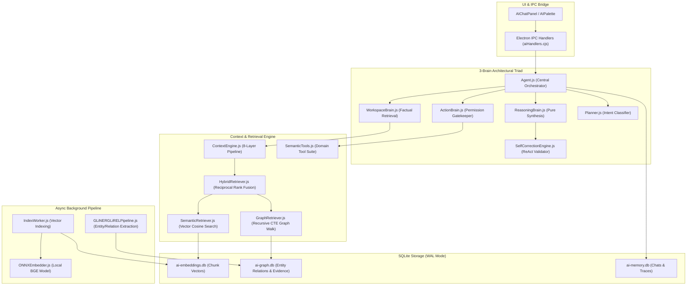

# Notely AI Platform — Comprehensive AI & Agent Subsystem Architecture

This directory contains the codebase for Notely's local-first, modular AI platform. Markdown notes remain the single source of truth, parsed and indexed into offline-first SQLite databases (`ai-embeddings.db`, `ai-graph.db`, `ai-memory.db`).

---

## AI Platform Overview & Design Philosophy

Notely's AI is engineered as an **intelligent knowledge companion** rather than a generic LLM chatbot wrapper.

### Core Guiding Principles:
1. **Human-like & Natural**: Speaks like a knowledgeable pair programmer and workspace teammate. Never exposes internal technical mechanics (`"search_notes"`, `"vector similarity"`, `"knowledge graph nodes"`).
2. **Context-Aware & Grounded**: Proactively retrieves workspace facts before generating answers. All claims are grounded in verified note file links (`[file.md](file:///path)`).
3. **Strict Note Immutability**: Existing notes are **100% read-only**. AI tools cannot update, edit, move, rename, or delete existing user notes under any circumstances.
4. **Local-First & Provider Agnostic**: Leverages local ONNX embeddings (`BGE-small-en-v1.5`) and background worker processes (`utilityProcess`), while supporting Gemini, Groq, OpenAI, and Local GGUF models.

---

## Complete 3-Brain Subsystem Architecture



---

## Subsystem Component Reference

### 1. 3-Brain Architectural Triad

| Component | File Path | Architectural Responsibility | Key Safeguards & Capabilities |
|---|---|---|---|
| **WorkspaceBrain** | [`ai/core/WorkspaceBrain.js`](file:///c:/Users/oksbw/OneDrive/Desktop/Antigravity%20Workspace/Notely/ai/core/WorkspaceBrain.js) | Factual Retrieval & Context Aggregation | Proactively gathers active note text, vector similarity matches, and graph hops for every query. |
| **ReasoningBrain** | [`ai/core/ReasoningBrain.js`](file:///c:/Users/oksbw/OneDrive/Desktop/Antigravity%20Workspace/Notely/ai/core/ReasoningBrain.js) | Analytical Reasoning & Synthesis | Synthesizes natural human responses. Has **zero direct access to disk or SQLite**. |
| **ActionBrain** | [`ai/core/ActionBrain.js`](file:///c:/Users/oksbw/OneDrive/Desktop/Antigravity%20Workspace/Notely/ai/core/ActionBrain.js) | Permission Gatekeeper & Execution Safety | Permanently blocks `update_note`, `delete_note`, `move_note`, `rename_note`. Rejects file overwrites on `create_note`. |

### 2. Planning & Tool Ecosystem

| Component | File Path | Responsibility | Capabilities |
|---|---|---|---|
| **Planner** | [`ai/core/Planner.js`](file:///c:/Users/oksbw/OneDrive/Desktop/Antigravity%20Workspace/Notely/ai/core/Planner.js) | Intent Classification & Planning | Classifies query intent (`DirectQuery`, `TopicExploration`, `TimelineReconstruction`, `TaskSummary`) and generates plan graphs. |
| **SemanticTools** | [`ai/tools/SemanticTools.js`](file:///c:/Users/oksbw/OneDrive/Desktop/Antigravity%20Workspace/Notely/ai/tools/SemanticTools.js) | High-Level Domain Tools | Exposes `find_discussions`, `find_architecture`, `find_people_and_tasks`, `reconstruct_timeline`, `explore_topic_graph`. |

### 3. Prompting, Persona & Grounding System

| Component | File Path | Responsibility | Features |
|---|---|---|---|
| **PromptLibrary** | [`ai/core/PromptLibrary.js`](file:///c:/Users/oksbw/OneDrive/Desktop/Antigravity%20Workspace/Notely/ai/core/PromptLibrary.js) | Modular System Prompts | Assembles base policies, dynamic domain context inference, active persona instructions, and workspace context. |
| **PersonaStandard** | [`ai/personas/PersonaStandard.js`](file:///c:/Users/oksbw/OneDrive/Desktop/Antigravity%20Workspace/Notely/ai/personas/PersonaStandard.js) | Persona Specification Schema | Validates JSON persona specifications (`id`, `name`, `tone`, `responseStructure`, `systemInstructions`). |
| **GroundingEngine** | [`ai/core/GroundingEngine.js`](file:///c:/Users/oksbw/OneDrive/Desktop/Antigravity%20Workspace/Notely/ai/core/GroundingEngine.js) | Citation Link Validator | Audits file link citations (`[label](file:///path)`) against disk and strips broken links before response output. |
| **SelfCorrectionEngine**| [`ai/core/SelfCorrectionEngine.js`](file:///c:/Users/oksbw/OneDrive/Desktop/Antigravity%20Workspace/Notely/ai/core/SelfCorrectionEngine.js) | ReAct Response Validation Pass | Intercepts draft responses, strips leaked technical tool narration jargon, and validates grounding. |

### 4. Diagnostics & Testing Harness

| Component | File Path | Responsibility | Metrics Tracked |
|---|---|---|---|
| **AgentHarness** | [`ai/diagnostics/AgentHarness.js`](file:///c:/Users/oksbw/OneDrive/Desktop/Antigravity%20Workspace/Notely/ai/diagnostics/AgentHarness.js) | Automated Evaluation Harness | Evaluates scenarios for Latency (ms), Tokens Used, Grounding Accuracy (%), and Zero-Jargon Score (%). |

---

## 8-Layer Context Assembly Pipeline

Every LLM request passes through an explicit 8-layer context pipeline inside `ContextEngine.js`:

1. **Layer 1: Immediate UI Context**: Active note path, text selection, cursor position.
2. **Layer 2: Conversation Memory**: Recent message history from `ConversationStore.js`.
3. **Layer 3: Current Workspace Context**: Workspace folder root, active project name, open tabs.
4. **Layer 4: Current Note Context**: Full text of active note & frontmatter metadata (capped to 4000 tokens).
5. **Layer 5: Graph Relationships**: Connected entities, backlinks, authors from `GraphDB.js`.
6. **Layer 6: Embedding Retrieval**: Top-K semantically relevant vector chunks from `EmbeddingDB.js`.
7. **Layer 7: Knowledge Fusion**: Reciprocal Rank Fusion (RRF) deduplicated evidence payload.
8. **Layer 8: System & Persona Prompt**: Modular persona instructions & grounding policies.

---

## Hybrid Retrieval (Reciprocal Rank Fusion - RRF)

`HybridRetriever.js` combines vector semantic rank and keyword search rank:

$$RRF\_Score(d) = \sum_{m \in M} \frac{1}{k + r_m(d)}$$

where $k = 60$.

---

## SQLite Database Schemas & Storage Locality

Global configurations reside in `%AppData%/notely/`, while workspace indexes reside in `.notes-app/`:

| Database File | Tables | Purpose & Schema Highlights |
|---|---|---|
| `ai-embeddings.db` | `chunks`, `note_hashes`, `indexing_queue` | Chunk vectors stored as 384 float32 `BLOB` fields (1536 bytes per vector). |
| `ai-graph.db` | `entities`, `relationships`, `evidence`, `entity_aliases` | Property Graph nodes, edges (`links_to`, `tagged`, `mentions`), and raw sentence evidence strings. |
| `ai-memory.db` | `interactions`, `patterns`, `messages`, `conversations` | Conversation history, user pattern learning, and diagnostic execution traces. |

### Incremental Boot Indexing Safeguard
`GraphDB.isNoteUpToDate(notePath, mtimeMs)` parses SQLite `updated_at` timestamps using explicit UTC formatting (`new Date(utcString).getTime()`). Unchanged notes evaluate as up-to-date on boot, skipping re-extraction and avoiding unnecessary neural ONNX model loads (`GLiNER + GLiREL`).

---

## Verification & Test Suite Execution

All AI subsystem components are covered byVitest test suites under `tests/ai/`:

```bash
node node_modules/vitest/vitest.mjs run tests/ai
```

### Test Suite Map:
- `tests/ai/brainTriad.spec.js`: 3-Brain isolation & note immutability tests.
- `tests/ai/planner.spec.js`: Intent classification & semantic tools tests.
- `tests/ai/grounding.spec.js`: Citation link verification & prompt composition tests.
- `tests/ai/selfCorrection.spec.js`: ReAct validation pass & zero-jargon gate tests.
- `tests/ai/harness.spec.js`: Evaluation harness metrics tests.
- `tests/ai/auditTools.spec.js`: Note length capping & read-only enforcement tests.
- `tests/ai/knowledgeGraph.spec.js`: Recursive CTE graph traversal tests.
- `tests/ai/pipeline.spec.js`: End-to-end Knowledge Graph pipeline tests.
