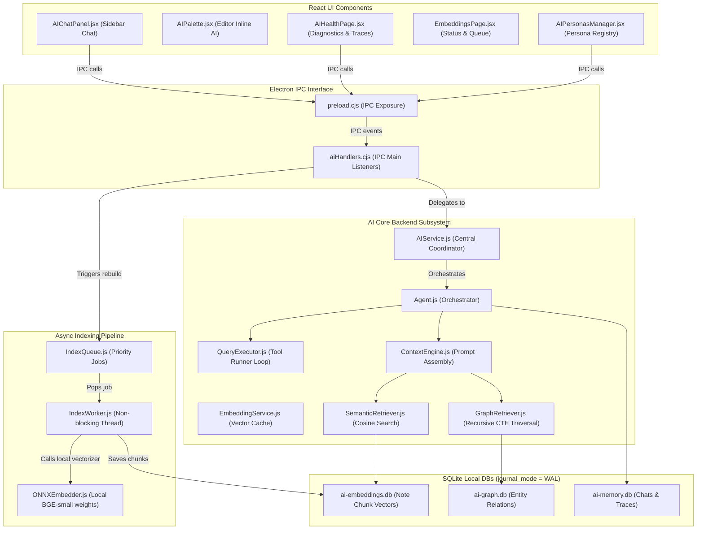

# Notely AI Subsystem Architecture

This directory contains the codebase for Notely's local-first, modular AI platform. Markdown remains the single source of truth, parsed and indexed into offline-first SQLite databases.

---

## Subsystem Architecture Diagram



---

## Data Locality & Files

All application-wide settings and keys reside in the system Application Data folder (`%AppData%/notely/`), while workspace-scoped indexes reside in the hidden `.notes-app/` folder:

| Scope | Filename | Purpose |
|---|---|---|
| **Global** | `ai-config.json` | API keys (encrypted via safeStorage) & active provider configuration |
| **Global** | `ai-preferences.json` | Feature flags, custom personas, and active embedding provider selections |
| **Global** | `ai-model/` | Downloaded local ONNX model weights (`BGE-small-en-v1.5`, ~130MB) |
| **Workspace** | `ai-embeddings.db` | Note chunk text, coordinate line mappings, vectors, and queue states |
| **Workspace** | `ai-graph.db` | Note node references and entity-relation triples |
| **Workspace** | `ai-memory.db` | Chat history messages, custom traces metadata, and user patterns log |

---

## Optimizations

### 1. SQLite WAL Mode
All database connections are initialized with:
```sql
PRAGMA foreign_keys = ON;
PRAGMA journal_mode = WAL;
PRAGMA synchronous = NORMAL;
```
This reduces disk write overhead and permits simultaneous reads without write blocking.

### 2. In-Memory Vector Cache
`EmbeddingService.js` maintains an in-memory cache map for hot embedding vectors. Repeated calls to `generateVector` or `generateEmbedding` for the same text contents return values instantly without calling remote LLM API providers or local ONNX runtime calculations.

### 3. TTL Graph Cache
`GraphRetriever.js` caches recursive CTE Knowledge Graph queries for 60 seconds (`TTL = 60000ms`), preventing redundant query execution on large workspaces during fast, conversational chat sequences.
