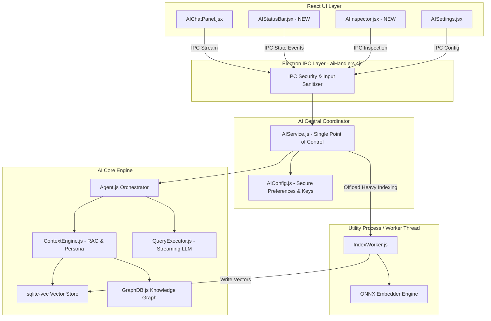

# Notely AI Validation & Gap Analysis

**Document Version:** 1.0.0  
**Date:** July 20, 2026  
**Role:** Principal Software Architect, AI Systems Architect, Senior QA Engineer & UX Architect  
**Status:** Single Source of Truth for Notely AI Subsystem Production Readiness

---

# Executive Summary

A comprehensive validation and gap analysis of the Notely AI subsystem was conducted across all 21 architectural, lifecycle, performance, diagnostics, and UX subsystems. The core building blocks of Notely's AI functionality (Vercel AI SDK integration, local SQLite databases for embeddings, memory, and knowledge graph, ONNX local embeddings, HuggingFace integration, and persona management) have been constructed. However, critical architecture bypasses, missing lifecycle event hooks, lack of token-by-token streaming, absent UI toggles, and main-thread processing bottlenecks prevent the AI subsystem from being production ready.

## Overall Production Readiness Score: **62 / 100**

| Subsystem Area | Status | Score | Key Takeaway |
| :--- | :---: | :---: | :--- |
| **AI Master Switch** | ⚠ Needs Improvement | 40% | IPC handlers exist, but startup bypasses switch & no UI toggle exists. |
| **AI Lifecycle Management** | ✗ Missing | 30% | File save, rename, and delete IPC events fail to trigger DB updates or cleanups. |
| **AI Manager Architecture** | ⚠ Needs Improvement | 60% | Dual init paths in `main.cjs` vs `AIService.js`; split state ownership. |
| **AI Chat & Streaming** | ⚠ Needs Improvement | 65% | Functional chat, but missing token streaming, cancellation, and diff previews. |
| **Conversation Persistence** | ⚠ Needs Improvement | 70% | SQLite storage built, but `AIChatPanel` resets state on open; thread drawer missing. |
| **Embeddings & Vector DB** | ⚠ Needs Improvement | 65% | Local ONNX + HF works, but cosine similarity runs via in-memory JS loops without vector index. |
| **Knowledge Graph** | ⚠ Needs Improvement | 60% | Graph DB built, but extraction relies on expensive full LLM calls; visualizer isolated. |
| **Search Index & Retrieval** | ⚠ Needs Improvement | 65% | Separate vector & graph tools exist, but no hybrid BM25 + dense RRF context fusion. |
| **RAG Pipeline & Context** | ⚠ Needs Improvement | 70% | Dual Groq vs Vercel AI SDK paths; active note content invalidates prompt cache. |
| **AI Settings & Config** | ⚠ Needs Improvement | 65% | API key/model UI present, but missing Master Switch toggle and runtime sliders. |
| **Background Jobs & Worker** | ⚠ Needs Improvement | 55% | `IndexWorker` runs in main process event loop via `setImmediate`, risking main thread stutter. |
| **Diagnostics & Health** | ✓ Complete | 90% | `AIHealth.js` and `AIHealthPage.jsx` are well-structured and comprehensive. |
| **AI Status Bar** | ✗ Missing | 0% | No UI status bar indicating AI status, worker indexing progress, or active provider. |
| **AI Inspector** | ✗ Missing | 0% | No developer/power-user drawer to inspect RAG context, similarity scores, or prompt payloads. |
| **Performance & Recovery** | ⚠ Needs Improvement | 60% | Lack of vector index, main-thread ONNX inference, and automatic provider failover. |
| **Error Handling & Logging** | ⚠ Needs Improvement | 70% | IPC response wrapping is solid, but worker failures and Groq tool errors fail silently. |
| **UI / UX Excellence** | ⚠ Needs Improvement | 65% | Sleek aesthetics, but non-streaming text, static starter prompts, and missing history list hurt UX. |

---

# Subsystem Status Matrix

Below is the verification summary of all 21 AI validation areas evaluated against production standards:

1. **AI Master Switch**: ⚠ Needs Improvement  
2. **AI Manager Architecture**: ⚠ Needs Improvement  
3. **AI Chat**: ⚠ Needs Improvement  
4. **Conversation Persistence**: ⚠ Needs Improvement  
5. **Conversation History**: ⚠ Needs Improvement  
6. **Embeddings**: ⚠ Needs Improvement  
7. **Knowledge Graph**: ⚠ Needs Improvement  
8. **Vector Database**: ⚠ Needs Improvement  
9. **Search Index**: ⚠ Needs Improvement  
10. **Context Retrieval**: ⚠ Needs Improvement  
11. **RAG Pipeline**: ⚠ Needs Improvement  
12. **AI Settings**: ⚠ Needs Improvement  
13. **Background Jobs**: ⚠ Needs Improvement  
14. **Lifecycle Management**: ✗ Missing  
15. **Logging**: ⚠ Needs Improvement  
16. **AI Status Bar**: ✗ Missing  
17. **AI Inspector**: ✗ Missing  
18. **Performance**: ⚠ Needs Improvement  
19. **Recovery**: ⚠ Needs Improvement  
20. **UI/UX**: ⚠ Needs Improvement  
21. **Error Handling**: ⚠ Needs Improvement  

---

# Critical Gaps

Items that **must** be resolved prior to production release.

## 1. Main Process Startup Bypasses AI Master Switch
- **Location:** `electron/main.cjs` (`initializeAIForWorkspace`), `ai/core/AIService.js`
- **Issue:** When the Electron application launches, `main.cjs` directly invokes `initializeAISystem()`, instantiates `EmbeddingDB`, `IndexQueue`, and calls `IndexWorker.start()`. It fails to check `prefs.aiEnabled !== false`. As a result, ONNX/HF embeddings, background indexing, SQLite database connections, and full workspace file scanning execute even when the user has explicitly disabled AI.
- **Risk:** High CPU/memory consumption on startup for users who turned off AI; privacy compliance violation.

## 2. Missing Master Switch Control in User Settings UI
- **Location:** `src/components/AISettings.jsx`, `electron/ai/aiHandlers.cjs`
- **Issue:** While `aiHandlers.cjs` registers `ai:enable` and `ai:disable` IPC endpoints, `AISettings.jsx` contains no Master Switch toggle button. The user has zero UI visibility or ability to toggle AI on or off.

## 3. Note Lifecycle Events Do Not Update or Clean AI Databases
- **Location:** `electron/lib/documents/documentIpc.cjs` (`documents:save`, `documents:delete`, `documents:rename`)
- **Issue:**
  - **Save:** Saving a note does not enqueue the modified file into `IndexQueue` or schedule incremental graph relationship extraction. Embeddings and graph nodes remain stale until a manual full rebuild is triggered.
  - **Delete:** Deleting a note (`documents:delete`) removes the `.md` file from disk but leaves orphaned vector chunks in `ai-embeddings.db` (`chunks` and `note_hashes` tables) and orphaned nodes/edges in `ai-graph.db` (`entities` and `relationships` tables).
  - **Rename:** Renaming a note (`documents:rename`) leaves all vector chunks and knowledge graph relationships assigned to the old file path, breaking semantic search citations and graph pathfinding.

## 4. Non-Streaming Response Architecture in AI Chat
- **Location:** `ai/core/QueryExecutor.js`, `electron/ai/aiHandlers.cjs`, `src/components/AIChatPanel.jsx`
- **Issue:** AI queries use synchronous/blocking promise resolution (`generateText` from Vercel AI SDK and `groq.chat.completions.create` from Groq SDK). The backend waits for the complete LLM text generation before sending a single IPC reply.
- **Risk:** The user experiences 3–15 second freezing/lag without streaming tokens, leading to perceived application unresponsiveness.

---

# High Priority Improvements

Major missing capabilities required for an enterprise-grade AI experience.

## 1. In-Memory Cosine Similarity Loop Over Array of All Vector Chunks
- **Location:** `ai/context/SemanticRetriever.js` (`search`), `ai/embeddings/EmbeddingDB.js` (`getAllChunks`)
- **Issue:** `SemanticRetriever.search()` retrieves all vector blobs from SQLite, deserializes them into JavaScript `Float32Array` objects, and performs an $O(N)$ loop calculating cosine similarity in JS for every query.
- **Impact:** As note count scales past 1,000 notes (10,000+ chunks), query latency degrades exponentially and memory usage spikes.
- **Recommendation:** Integrate `sqlite-vec` extension or maintain an HNSW vector index file for vector retrieval directly inside SQLite or native C++ addon.

## 2. Main Process Event Loop Thread Locking During Heavy ONNX Embedding Tasks
- **Location:** `ai/queue/IndexWorker.js`, `ai/embeddings/ONNXEmbedder.js`
- **Issue:** `IndexWorker` executes ONNX model inference directly inside Electron's main process. Although `await new Promise(resolve => setImmediate(resolve))` is called between chunks, batch embedding generation still starves the main process event loop, causing UI frame drops and input lag in the editor.
- **Recommendation:** Offload `IndexWorker` and ONNX model execution to a dedicated Node.js `worker_threads` instance or Electron `utilityProcess`.

## 3. Disconnected Conversation History in AIChatPanel
- **Location:** `src/components/AIChatPanel.jsx`, `ai/memory/ConversationStore.js`
- **Issue:** While `ConversationStore` correctly persists conversations and messages to `ai-memory.db`, opening `AIChatPanel` initializes a local blank state (`messages = []`). Users cannot switch between past chat sessions, view conversation history, or resume past AI threads from within the chat UI. (Conversation viewing currently exists only inside the diagnostic `AIHealthPage.jsx`).

## 4. Lack of Citation Links Back to Source Note Lines
- **Location:** `ai/context/SemanticRetriever.js`, `ai/core/QueryExecutor.js`, `src/components/AIChatPanel.jsx`
- **Issue:** When the RAG pipeline retrieves note chunks, chunk line numbers (`start_line`, `end_line`) are stored in `chunks` table but not surfaced to the LLM or rendered as interactive markdown links `[Note.md#L12-L24](file://...)` in `AIChatPanel`. Users cannot verify source references.

---

# Medium Priority Improvements

Important enhancements for stability and capability.

## 1. Prompt Cache Invalidation Caused by Active Note Context Location
- **Location:** `ai/context/ContextEngine.js` (`buildContext`)
- **Issue:** `ContextEngine` appends the full active note content to the system prompt (`system`). Because the active note content changes on every keystroke, the LLM provider cannot leverage prompt caching (e.g. Gemini / Anthropic system prompt caching), increasing latency and API costs.
- **Recommendation:** Inject active note content into a dedicated context message block in the messages payload rather than modifying the static persona system prompt.

## 2. Dual Provider Routing Discrepancy (Groq vs Vercel AI SDK)
- **Location:** `ai/core/QueryExecutor.js`
- **Issue:** `QueryExecutor.js` splits execution into two entirely separate code paths: a custom while-loop using `groq-sdk` for Groq, and `generateText` from `ai` for all other providers. The Groq path implements custom tool-call loop handling, trace recording, and token accounting, while the Vercel AI SDK path uses `maxSteps: 5`. This duplication leads to feature drift, inconsistent error handling, and trace format differences.
- **Recommendation:** Standardize all providers (including Groq) on the `@ai-sdk/groq` provider package via Vercel AI SDK `generateText` / `streamText`.

## 3. Knowledge Graph Entity Extraction Overuses Expensive LLM API Calls
- **Location:** `ai/graph/GraphService.js` (`processNote`), `ai/graph/GraphBuilder.js`
- **Issue:** Rebuilding the Knowledge Graph sends every single markdown note content to the LLM with a complex JSON extraction prompt. For a 200-note workspace, this consumes 200 API calls, incurring significant API cost and time.
- **Recommendation:** Implement a deterministic hybrid extractor: extract wikilinks (`[[Note]]`), markdown headers, and tags (`#tag`) locally via regex/AST first, reserving LLM extraction only for unlinked concept discovery.

## 4. Lack of Cancellation (AbortController) Support in IPC and AI Service
- **Location:** `electron/ai/aiHandlers.cjs` (`handleQuery`), `ai/core/AIService.js`, `ai/core/QueryExecutor.js`
- **Issue:** When an AI query is in flight, closing the `AIChatPanel` or clicking a "Stop" button does not abort the underlying HTTP request to Gemini/Groq/OpenAI. The LLM request continues running in the background, consuming API tokens.

---

# Low Priority Improvements

Nice-to-have polish items.

## 1. Static Starter Prompts in AIChatPanel
- **Location:** `src/components/AIChatPanel.jsx` (`buildStarterPrompts`)
- **Issue:** Starter prompts are hardcoded static strings based only on whether a document is open. They do not analyze the current note's tags, title, or content to offer context-aware suggestions (e.g., "Summarize budget table", "Convert code snippet to TypeScript").

## 2. Persona Prompt Editing UI Constraints
- **Location:** `src/components/AIPersonasManager.jsx`, `src/components/AIChatPanel.jsx`
- **Issue:** Personas can be selected in `AIChatPanel` dropdown, but editing system prompts requires opening the dedicated Persona Manager. Adding an inline system prompt preview / quick-tweak popover in `AIChatPanel` will improve power-user workflow.

## 3. Missing Export / Backup Option for Local Vector and Graph DBs
- **Location:** `src/components/AISettings.jsx`, `ai/embeddings/EmbeddingDB.js`, `ai/graph/GraphDB.js`
- **Issue:** There is no UI button to export or back up `.notes-app/ai-embeddings.db` or `ai-graph.db`, or clear specific note vectors without clearing the entire database.

---

# Technical Debt

Refactoring and cleanup tasks.

## 1. Dual Manager Pattern & Split Instance State
- **Location:** `electron/main.cjs`, `ai/core/AIService.js`, `ai/index.js`
- **Debt:** `main.cjs` holds its own global `aiAgent` variable and directly instantiates `EmbeddingDB`, `IndexQueue`, `IndexWorker`. Meanwhile, `AIService.js` maintains a singleton instance of `AIService` with its own `agent` property. Handlers in `aiHandlers.cjs` call `aiService` methods for some operations and direct `aiService.agent` properties for others.
- **Fix:** Unify all AI lifecycle and state management into `AIService.js` as the sole backend authority. `main.cjs` should interact exclusively through `aiService.initialize()` and `aiService.shutdown()`.

## 2. Legacy ContextManager Overlaps With Phase 5 ContextEngine
- **Location:** `ai/context/ContextManager.js`, `ai/context/ContextEngine.js`
- **Debt:** `ContextManager.js` maintains an in-memory document index and cache using legacy `DocumentReader`, performing basic keyword search. `ContextEngine.js` implements semantic and graph retrievers with Vercel AI SDK tools. Both exist simultaneously in `Agent.js`, leading to duplicated document reading logic.
- **Fix:** Consolidate `ContextManager` functionality into `ContextEngine` and remove redundant file indexing mechanisms.

## 3. Ad-Hoc Table Alterations for Database Migrations
- **Location:** `ai/memory/MemoryDB.js`, `ai/memory/PersonaDB.js`
- **Debt:** Schema changes are handled using `try { db.exec('ALTER TABLE ...'); } catch {}` blocks upon database initialization.
- **Fix:** Implement a lightweight versioned migration runner (e.g. `PRAGMA user_version`) for SQLite database files (`ai-memory.db`, `ai-embeddings.db`, `ai-graph.db`).

---

# Architecture Improvements

Suggested structural enhancements.

## Key Architectural Enhancements:
1. **Single Controller Pattern:** All AI subsystems owned exclusively by `AIService.js`.
2. **Worker Thread Offloading:** Background indexing and ONNX tensor computation isolated to an Electron `utilityProcess`.
3. **Native Vector Extension (`sqlite-vec`):** Fast vector similarity search inside SQLite engine replacing JS loops.
4. **Unified Event Bus:** Real-time IPC events pushed from `AIService` to UI for status bar updates and progress indicators.

---

# Performance Improvements

Opportunities to reduce CPU, memory, database operations, and background compute.

## 1. Vector Indexing Performance ($O(N)$ to $O(\log N)$)
- **Current:** Deserializing all BLOBs from `chunks` table into JS Float32Arrays and computing cosine similarity in JavaScript.
- **Target:** Use SQLite vector extension (`sqlite-vec`) or quantized embeddings to achieve sub-10ms semantic search across 50,000+ chunks.

## 2. Selective Document Chunking & Hashing
- **Current:** Modifying a single character in a 20-page document causes `IndexWorker` to re-chunk and re-generate embeddings for all chunks in the note.
- **Target:** Implement differential chunk hashing. Compare individual chunk content hashes before vectorization so only modified paragraphs incur LLM/ONNX vector generation cost.

## 3. Lazy ONNX Model Loading
- **Current:** ONNX model files are checked and prepared during app boot.
- **Target:** Instantiate ONNX runtime sessions strictly on demand when an embedding queue job is executed.

---

# UX Improvements

Usability enhancements required for a modern AI workspace.

## 1. AI Status Bar Component (`AIStatusBar.jsx`)
- **Requirement:** A sleek bottom status bar component displaying:
  - Active LLM Provider & Model (e.g. `Gemini 2.0 Flash`).
  - Embeddings Status (`Local ONNX Ready` / `Indexing 12/45 notes` / `Disabled`).
  - Master Switch Quick Toggle.
  - Connection health indicator (Green dot = Connected, Red dot = Error/No API Key).

## 2. AI Inspector Component (`AIInspector.jsx`)
- **Requirement:** A developer and power-user drawer accessible from `AIChatPanel` showing:
  - Exact system prompt sent to the LLM (including persona instructions).
  - Retrieved RAG note chunks with similarity scores.
  - Knowledge graph traversal paths used in context assembly.
  - Token counts (Prompt tokens, Completion tokens, Total cost estimation).
  - Tool execution timeline and raw JSON outputs.

## 3. Real-Time Token Streaming Animation
- **Requirement:** Render AI responses token-by-token using ReadableStream / IPC stream events, with auto-scroll and a "Stop Generation" button.

## 4. Interactive Note File References & Inline Diff Preview
- **Requirement:**
  - Render note citations as clickable links `[Filename.md#L45](file://...)` that open the note in the editor and highlight the exact line.
  - When the AI generates text replacements, provide an inline "Preview Diff" button before applying changes directly to the active Markdown editor.

## 5. First-Time Onboarding AI Setup Flow (`OnboardingFlow.jsx`)
- **Requirement:**
  - Expand Step 4 of the onboarding wizard to provide complete initial AI setup:
    - AI Master Switch toggle (Enable/Disable AI globally).
    - Text Provider selection (Google Gemini, Groq, OpenAI) with inline API key input field.
    - Embedding Provider selection (Local ONNX BGE model vs HuggingFace vs Provider Native).
    - One-click Local ONNX model download trigger button with live download progress bar directly inside onboarding.

---

# Validation Findings

Detailed findings for every identified issue, formatted according to validation guidelines.

---

## Finding AI-01: Main Process Startup Initializes AI Subsystem When AI Master Switch Is Disabled

- **Priority:** Critical
- **Current Behaviour:** In `electron/main.cjs`, `initializeAIForWorkspace()` directly requires `ai/index.js`, initializes `DatabaseManager`, loads ONNX/HF configurations, creates `EmbeddingDB`, `IndexQueue`, and invokes `IndexWorker.start()` on application boot without reading `prefs.aiEnabled`.
- **Expected Behaviour:** When `prefs.aiEnabled === false`, no AI modules should be initialized, no SQLite AI databases should be opened, no background workers should start, and zero AI compute resources should be consumed.
- **Recommendation:** Wrap `initializeAIForWorkspace()` in `main.cjs` with an explicit check for `aiService.isEnabled()`. Do not boot `IndexWorker` or `EmbeddingDB` if AI is disabled.
- **Dependencies:** `electron/main.cjs`, `ai/core/AIService.js`, `ai/core/AIConfig.js`
- **Estimated Complexity:** Low (1 day)

---

## Finding AI-02: Missing AI Master Switch Toggle in React UI

- **Priority:** Critical
- **Current Behaviour:** `aiHandlers.cjs` provides IPC handlers `ai:enable` and `ai:disable`, but `AISettings.jsx` lacks a Master Switch toggle. Users cannot enable or disable the AI subsystem from the UI.
- **Expected Behaviour:** A prominent Master Switch toggle at the top of AI Settings and AI Status Bar allowing users to toggle AI functionality globally.
- **Recommendation:** Add a Master Switch card in `AISettings.jsx` wired to `aiEnable()` / `aiDisable()` IPC calls. Update UI context state accordingly.
- **Dependencies:** `src/components/AISettings.jsx`, `electron/ai/aiHandlers.cjs`, `src/services/electronService.js`
- **Estimated Complexity:** Low (1 day)

---

## Finding AI-03: Note Save, Rename, and Delete Lifecycle Events Bypass AI Database Sync

- **Priority:** Critical
- **Current Behaviour:** 
  - `documents:save` writes markdown to disk without enqueuing modified files for vector re-indexing or graph relationship updates.
  - `documents:delete` removes the file from disk, leaving stale records in `chunks`, `note_hashes`, `entities`, and `relationships` tables.
  - `documents:rename` renames the file on disk, leaving vector chunks and graph edges attached to the old file path.
- **Expected Behaviour:**
  - Note save enqueues the note path in `IndexQueue` (if content hash changed) and updates graph nodes.
  - Note delete immediately purges corresponding records from `EmbeddingDB` and `GraphDB`.
  - Note rename updates all foreign keys and `note_path` attributes in `EmbeddingDB` and `GraphDB`.
- **Recommendation:** Add event hooks inside `electron/lib/documents/documentIpc.cjs` to invoke `aiService.onNoteSave(filePath)`, `aiService.onNoteDelete(filePath)`, and `aiService.onNoteRename(oldPath, newPath)`.
- **Dependencies:** `electron/lib/documents/documentIpc.cjs`, `ai/core/AIService.js`, `ai/embeddings/EmbeddingDB.js`, `ai/graph/GraphDB.js`
- **Estimated Complexity:** Medium (2-3 days)

---

## Finding AI-04: Non-Streaming AI Chat Query Execution

- **Priority:** High
- **Current Behaviour:** `QueryExecutor.js` executes queries using synchronous `generateText()` and `groq.chat.completions.create()`. The entire response is buffered on the backend and sent across IPC as a single payload after completion.
- **Expected Behaviour:** Text responses stream token-by-token from the LLM provider to the frontend chat UI via IPC webContents stream events.
- **Recommendation:** Migrate `QueryExecutor.js` to Vercel AI SDK `streamText()`. Emit `ai:chat:chunk` IPC events to the active `BrowserWindow`.
- **Dependencies:** `ai/core/QueryExecutor.js`, `electron/ai/aiHandlers.cjs`, `src/services/electronService.js`, `src/components/AIChatPanel.jsx`
- **Estimated Complexity:** Medium (3 days)

---

## Finding AI-05: In-Memory Cosine Similarity Loop Limits Scalability

- **Priority:** High
- **Current Behaviour:** `SemanticRetriever.js` queries all rows from `chunks`, deserializes Float32Array vectors in JS memory, and runs a JS loop calculating cosine similarity for every search query.
- **Expected Behaviour:** Vector similarity search executes natively within SQLite using vector indexing extensions or native C bindings in $<50\text{ms}$.
- **Recommendation:** Integrate `sqlite-vec` or write a native SQLite C extension for dot-product vector search.
- **Dependencies:** `ai/embeddings/EmbeddingDB.js`, `ai/context/SemanticRetriever.js`
- **Estimated Complexity:** High (4-5 days)

---

## Finding AI-06: Background IndexWorker Runs on Main Process Event Loop

- **Priority:** High
- **Current Behaviour:** `IndexWorker.js` handles ONNX vectorization inside Electron's main process, yielding execution using `setImmediate()`. Batch indexing causes noticeable UI frame drops during heavy file edits.
- **Expected Behaviour:** `IndexWorker` runs in a separate process/thread (`utilityProcess` or `worker_threads`), preventing main thread CPU starvation.
- **Recommendation:** Refactor `IndexWorker` to run as an Electron `utilityProcess` that communicates with `main.cjs` via IPC messaging.
- **Dependencies:** `electron/main.cjs`, `ai/queue/IndexWorker.js`, `ai/embeddings/ONNXEmbedder.js`
- **Estimated Complexity:** High (4-5 days)

---

## Finding AI-07: Chat Panel Fails to Restore Conversation History Threads

- **Priority:** High
- **Current Behaviour:** `AIChatPanel.jsx` maintains chat messages in local React component state (`messages = []`). Closing and reopening the panel resets the view to an empty chat, hiding past conversations stored in `ai-memory.db`.
- **Expected Behaviour:** `AIChatPanel.jsx` features a collapsible conversation thread drawer allowing users to switch between past chat sessions, delete sessions, or create new ones.
- **Recommendation:** Connect `AIChatPanel.jsx` to `aiConversationList()`, `aiConversationGetMessages()`, and `aiConversationCreate()` IPC endpoints.
- **Dependencies:** `src/components/AIChatPanel.jsx`, `electron/ai/aiHandlers.cjs`, `ai/memory/ConversationStore.js`
- **Estimated Complexity:** Medium (2-3 days)

---

## Finding AI-08: Active Note Content Injected into System Prompt Breaks LLM Caching

- **Priority:** Medium
- **Current Behaviour:** `ContextEngine.js` appends `CURRENT NOTE (...): ...` directly onto `system` prompt string. Keystrokes in the editor alter `system` prompt content, busting system prompt cache on every API call.
- **Expected Behaviour:** `system` prompt remains strictly static (persona definition). Active note context is passed as a dedicated context block in the user message payload or message array.
- **Recommendation:** Move active note context formatting out of `system` prompt string into user message payload formatting in `ContextEngine.js`.
- **Dependencies:** `ai/context/ContextEngine.js`, `ai/core/QueryExecutor.js`
- **Estimated Complexity:** Low (1 day)

---

## Finding AI-09: Knowledge Graph Extraction Uses Full LLM API Calls Per Note

- **Priority:** Medium
- **Current Behaviour:** `GraphService.js` sends raw note text to the LLM with a complex JSON extraction prompt to parse entities and relationships. Rebuilding the graph triggers $N$ sequential LLM API calls.
- **Expected Behaviour:** Fast, zero-cost local extraction for deterministic markdown elements (wikilinks `[[Note]]`, headers, `#tags`), reserving LLM entity extraction for opt-in or scheduled deep analysis.
- **Recommendation:** Implement a local regex/AST parser in `GraphService.js` for wikilinks and tags. Use LLM extraction only when explicitly requested.
- **Dependencies:** `ai/graph/GraphService.js`, `ai/graph/GraphBuilder.js`
- **Estimated Complexity:** Medium (2-3 days)

---

## Finding AI-10: Missing AI Status Bar Component

- **Priority:** Medium
- **Current Behaviour:** The application layout lacks any visual indicator showing current AI status, active provider, embedding indexing progress, or master switch state.
- **Expected Behaviour:** A dedicated `AIStatusBar.jsx` rendered in the application footer showing real-time AI metrics and provider status.
- **Recommendation:** Create `src/components/AIStatusBar.jsx` and subscribe to AI IPC health and worker status events.
- **Dependencies:** `src/components/AIStatusBar.jsx`, `src/App.jsx`, `electron/ai/aiHandlers.cjs`
- **Estimated Complexity:** Medium (2 days)

---

## Finding AI-11: Missing AI Inspector Component

- **Priority:** Medium
- **Current Behaviour:** Users and developers cannot inspect the raw context prompt, retrieved semantic chunks, graph traversal paths, or token costs for a given AI response.
- **Expected Behaviour:** An `AIInspector.jsx` slide-out panel allowing inspection of exact prompt payloads, chunk similarity scores, and execution traces.
- **Recommendation:** Create `src/components/AIInspector.jsx` and expose `trace` & context metadata from `QueryExecutor`.
- **Dependencies:** `src/components/AIInspector.jsx`, `src/components/AIChatPanel.jsx`
- **Estimated Complexity:** Medium (2 days)

---

## Finding AI-12: Absence of Citation Links Back to Source Note Line Numbers

- **Priority:** Low
- **Current Behaviour:** RAG responses textually reference information, but do not provide clickable markdown links to open the source note at the specific line.
- **Expected Behaviour:** Citations render as clickable links `[NoteName.md#L20](file://...)` that navigate the editor to the exact line.
- **Recommendation:** Format chunk metadata into standard markdown file links during context assembly and ensure `MarkdownPreview` handles `file://` line navigation.
- **Dependencies:** `ai/context/SemanticRetriever.js`, `src/components/AIChatPanel.jsx`
- **Estimated Complexity:** Low (1-2 days)

---

## Finding AI-13: Incomplete First-Time Onboarding AI Setup Flow

- **Priority:** High
- **Current Behaviour:** Step 4 of `OnboardingFlow.jsx` only shows basic checkboxes ("Enable AI Subsystem", "Default Text Provider", "Enable background embeddings"). It lacks API key input fields, embedding provider selection (Local ONNX vs HuggingFace), and local ONNX model download triggers. Users must complete onboarding and then manually open Settings > AI Settings to configure API keys or download local model weights.
- **Expected Behaviour:** First-time onboarding allows full AI initialization: toggling AI Master Switch, selecting Text Provider (Gemini/Groq/OpenAI), entering API key inline, selecting Embedding Provider, and downloading the local ONNX model weights with real-time download progress display directly inside the onboarding slide.
- **Recommendation:** Enhance `OnboardingFlow.jsx` step 4 with API key input fields, provider selector dropdowns, embedding strategy choice, and a local ONNX model download button integrated with `aiDownloadModel()` and `onModelDownloadProgress()`.
- **Dependencies:** `src/components/OnboardingFlow.jsx`, `src/services/electronService.js`, `electron/ai/aiHandlers.cjs`
- **Estimated Complexity:** Medium (2 days)

---

# Implementation Roadmap

An implementation-ready roadmap converting all validation findings into actionable phased tasks.

## Phase 1: AI Master Switch & Architecture Hardening
> **Goal:** Ensure 100% compliance with Master Switch enforcement and unify backend state management under `AIService`.

- [ ] **Task 1.1: Fix Main Process Startup Master Switch Bypass**
  - Update `electron/main.cjs` (`initializeAIForWorkspace`) to verify `aiService.isEnabled()` before initializing AI systems.
  - Ensure `IndexWorker`, `EmbeddingDB`, and background indexing do not execute when AI is disabled.
- [ ] **Task 1.2: Implement Master Switch UI Control in Settings**
  - Add Master Switch toggle card in `src/components/AISettings.jsx`.
  - Connect toggle to `ai:enable` and `ai:disable` IPC calls.
  - Add visual "AI Disabled" banner overlay across AI panels when master switch is off.
- [ ] **Task 1.3: Unify State Ownership under AIService**
  - Remove duplicate global `aiAgent` state from `electron/main.cjs`.
  - Route all AI lifecycle operations through `AIService.js`.

---

## Phase 2: Lifecycle Hooks & Data Consistency
> **Goal:** Ensure file operations (Save, Delete, Rename) seamlessly update or clean up SQLite vector and graph databases.

- [ ] **Task 2.1: Implement Note Save Lifecycle Hook**
  - Update `documents:save` handler in `electron/lib/documents/documentIpc.cjs` to invoke `aiService.onNoteSave(filePath)`.
  - Enqueue updated notes into `IndexQueue` and trigger incremental graph update.
- [ ] **Task 2.2: Implement Note Delete Lifecycle Hook**
  - Update `documents:delete` handler in `documentIpc.cjs` to invoke `aiService.onNoteDelete(filePath)`.
  - Delete vector chunks from `ai-embeddings.db` and nodes/relationships from `ai-graph.db`.
- [ ] **Task 2.3: Implement Note Rename Lifecycle Hook**
  - Update `documents:rename` handler in `documentIpc.cjs` to invoke `aiService.onNoteRename(oldPath, newPath)`.
  - Update `note_path` keys across `chunks`, `note_hashes`, `entities`, and `relationships` tables.

---

## Phase 3: Token Streaming & AI Chat UI Overhaul
> **Goal:** Deliver real-time token streaming, conversation session management, and source citations in the chat interface.

- [ ] **Task 3.1: Implement Token-by-Token IPC Streaming**
  - Refactor `ai/core/QueryExecutor.js` to use Vercel AI SDK `streamText()`.
  - Implement streaming IPC protocol in `aiHandlers.cjs` emitting `ai:chat:chunk` events.
  - Update `AIChatPanel.jsx` to render incoming text chunks in real time.
- [ ] **Task 3.2: Implement Abort / Stop Generation Control**
  - Add `AbortController` handling to `QueryExecutor.js` and IPC handlers.
  - Render "Stop Generation" button in `AIChatPanel.jsx`.
- [ ] **Task 3.3: Build Conversation History Thread Drawer in AIChatPanel**
  - Add collapsible session list drawer in `AIChatPanel.jsx`.
  - Wire drawer to `ai:conversation:list`, `ai:conversation:get-messages`, and `ai:conversation:create` IPC endpoints.
- [ ] **Task 3.4: Source Citations & Interactive File Links**
  - Format RAG chunk source paths into clickable markdown links `[Note.md#L10](file://...)`.
  - Enable editor line jump when citation link is clicked.

---

## Phase 4: Performance & Offloading
> **Goal:** Eliminate main-thread event loop lag and optimize vector search performance.

- [ ] **Task 4.1: Move IndexWorker to Electron UtilityProcess**
  - Refactor `IndexWorker.js` and `ONNXEmbedder.js` to run inside a dedicated Electron `utilityProcess`.
  - Establish IPC communication channel between main process and indexing process.
- [ ] **Task 4.2: Optimize Vector Search with Native SQLite Vector Extension**
  - Integrate `sqlite-vec` or quantized vector search in `EmbeddingDB.js`.
  - Eliminate in-memory JavaScript cosine similarity iteration.
- [ ] **Task 4.3: Implement Local Wikilink & Tag Graph Extractor**
  - Add deterministic regex/AST parser in `GraphService.js` to extract `[[wikilinks]]` and `#tags` locally without LLM API calls.

---

## Phase 5: Diagnostics, UI Inspection, Status Bar & Onboarding Flow
> **Goal:** Provide total operational visibility and a complete first-time onboarding AI setup.

- [ ] **Task 5.1: Build AI Status Bar Component (`AIStatusBar.jsx`)**
  - Create bottom status bar component displaying active provider, model name, worker indexing status, and Master Switch state.
  - Mount component in `src/App.jsx` footer.
- [ ] **Task 5.2: Build AI Inspector Component (`AIInspector.jsx`)**
  - Create slide-out inspector panel in `AIChatPanel.jsx`.
  - Render raw prompt payload, retrieved context chunks with similarity scores, graph traversal paths, and execution traces.
- [ ] **Task 5.3: Prompt Cache Optimization**
  - Move active note content out of `system` prompt into user message context in `ContextEngine.js`.
- [ ] **Task 5.4: Comprehensive First-Time Onboarding AI Setup (`OnboardingFlow.jsx`)**
  - Upgrade Step 4 of `OnboardingFlow.jsx` to include AI Master Switch toggle, Text Provider selector (Gemini/Groq/OpenAI) with inline API key input, Embedding Provider choice (Local ONNX vs HF vs Provider Native), and one-click Local ONNX model downloader with live progress bar.

