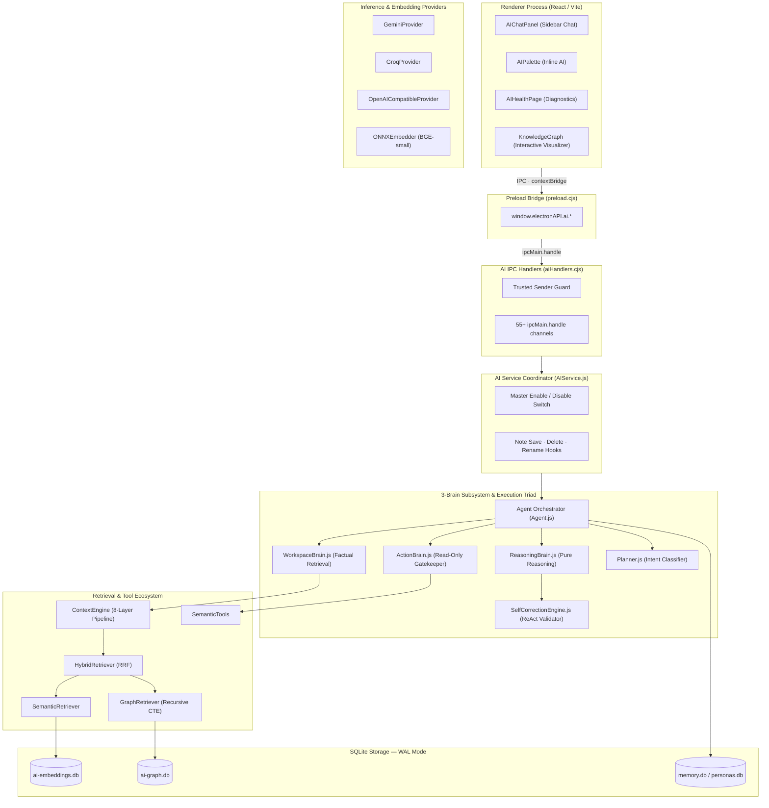

# AI Subsystem & 3-Brain Platform Architecture

Notely implements a local-first, offline-ready AI architecture designed for privacy, low latency, and deterministic grounding. Markdown notes remain the single source of truth, parsed and indexed into offline-first SQLite databases.

---

## 3-Brain Subsystem Blueprint

The following diagram shows the full request path from React Renderer UI through the 3-Brain Core, Retrieval Engines, and SQLite Storage Layers.



---

## 1. The 3-Brain Architectural Triad

To transition Notely from a reactive chatbot into a trustworthy knowledge companion, execution responsibilities are partitioned into three isolated architectural brains:

### 1. WorkspaceBrain (`WorkspaceBrain.js`)
* **Factual Retrieval**: Responsible for gathering active note context, executing vector similarity queries, and traversing knowledge graph relationships.
* **Proactive Retrieval**: Automatically executes keyword search (`FTS5`), semantic vector similarity, and graph relation hops for the user's current query topic on **every turn** before LLM generation.
* **Evidence Normalization**: Assembles normalized `WorkspaceFact[]` payloads ready for synthesis.

### 2. ReasoningBrain (`ReasoningBrain.js`)
* **Pure Analytical Reasoning**: Performs analytical reasoning, comparison, summarization, and answer synthesis.
* **Storage Isolation**: Possesses **zero direct storage or filesystem access**. Consumes strictly curated evidence context supplied by the `WorkspaceBrain`.
* **Confidence & Fallbacks**: Evaluates evidence sufficiency and falls back cleanly if no evidence matches the user query.

### 3. ActionBrain (`ActionBrain.js`)
* **Strict Read-Only Permission Boundary**: Acts as an execution gatekeeper for tool invocations and side effects.
* **Immutable Note Safety**: Permanently blocks tool actions that attempt to modify, update, move (`notes.move`), rename, or delete existing markdown notes (`update_note`, `delete_note`, `move_note`, `rename_note`).
* **Zero Overwrite Protection**: For `create_note`, checks whether a note file already exists at the target path; if it exists, execution is cleanly rejected with a safety notice.

---

## 2. Intent Planner & Semantic Tool Catalogue

Instead of forcing the LLM to understand low-level filesystem parameters, Notely provides an autonomous multi-step planner and domain-focused semantic tools:

### Autonomous Planner (`Planner.js`)
The `Planner` classifies user query intent into four operational categories:
1. **`DirectQuery`**: Single-turn factual retrieval.
2. **`TopicExploration`**: Multi-hop graph traversal and technical specification retrieval.
3. **`TimelineReconstruction`**: Chronological event mapping across notes.
4. **`TaskSummary`**: Action item aggregation across checklist items.

### Semantic Tool Catalogue (`SemanticTools.js`)

| Tool Name | Domain Intent | Safety Gate |
|---|---|---|
| `find_discussions` | Locates discussions, meetings, and decision rationale on a topic | Read-Only |
| `find_architecture` | Retrieves design documents, specs, and system architecture notes | Read-Only |
| `find_people_and_tasks` | Discovers assignees, `@mentions`, and open checklist action items | Read-Only |
| `reconstruct_timeline` | Builds a chronological history of changes and note updates | Read-Only |
| `explore_topic_graph` | Traverses entity graph for related notes, concepts, and technologies | Read-Only |
| `create_draft_note` | Creates a new note file (never overwriting existing files) | Write (New File Only) |

---

## 3. ReAct Loop & Self-Correction Engine (`SelfCorrectionEngine.js`)

Notely enforces a ReAct (Reason + Act) loop backed by Vercel AI SDK `generateText` (`maxSteps: 5`) and an automated response validation pass:

### ReAct Execution Flow
1. **Proactive Evidence Ingestion**: `WorkspaceBrain` ingests relevant workspace facts.
2. **Multi-Step Tool Reasoning**: The model reasons over facts and silently executes semantic tools if additional detail is required.
3. **Draft Synthesis**: `ReasoningBrain` synthesizes a natural human language response.
4. **Self-Correction Validation (`SelfCorrectionEngine.js`)**:
   * **Zero-Jargon Gate**: Intercepts draft responses and strips leaked technical tool narration jargon (e.g. *"I executed tool search_notes"*).
   * **Citation Link Audit**: Validates `[label](file:///path)` markdown links against the local disk using `GroundingEngine.js`. If a link target does not exist, converts the link to a plain text title label to prevent broken link clicks.
   * **Grounding Verification**: Ensures claims made about workspace notes match retrieved evidence payload.

---

## 4. Vector Embeddings Engine & Reciprocal Rank Fusion (RRF)

Notely utilizes a hybrid vector + keyword retrieval pipeline:

### SQLite Vector Storage (`ai-embeddings.db`)
Embeddings reside in `{workspace}/.notes-app/ai-embeddings.db`:
* **`chunks`**: Text blocks, file paths, line numbers, hashes, and binary `BLOB` vectors.
* **`note_hashes`**: Content hash tracking for incremental indexing.
* **`indexing_queue`**: Non-blocking background worker queue.

### Reciprocal Rank Fusion (RRF)
`HybridRetriever.js` combines vector semantic rank and keyword search rank:
$$RRF\_Score(d) = \sum_{m \in M} \frac{1}{k + r_m(d)}$$
where $k = 60$.

---

## 5. Knowledge Graph Subsystem & Incremental Boot Indexing

Notely maps note relationships inside `{workspace}/.notes-app/ai-graph.db`:

### Persistent Storage & UTC Date Fix
* **No Boot Rebuild**: `GraphDB.js` uses persistent SQLite tables (`CREATE TABLE IF NOT EXISTS`). Database contents are **NEVER deleted or dropped on application restart**.
* **UTC Timestamp Matching**: `GraphDB.isNoteUpToDate(notePath, mtimeMs)` parses SQLite `updated_at` strings with explicit UTC timezone markers (`new Date(utcString).getTime()`). Unchanged notes evaluate as `isNoteUpToDate = true`, skipping re-extraction on boot and eliminating unnecessary neural ONNX model loads (`GLiNER + GLiREL`).

---

## 6. AI Agent Evaluation Harness (`AgentHarness.js`)

Notely includes a production evaluation and diagnostic harness for regression testing:

```javascript
const harness = new AgentHarness(agent);
const metrics = await harness.runEvaluation(scenarios);
```

### Metrics Tracked:
* **Average Latency (ms)**: End-to-end processing duration per query scenario.
* **Total Token Consumption**: Tokens used across provider calls.
* **Grounding Accuracy (%)**: Percentage of file citations matching verified disk files.
* **Zero-Jargon Score (%)**: Compliance rate of responses emitting natural human tone without tool narration jargon.
