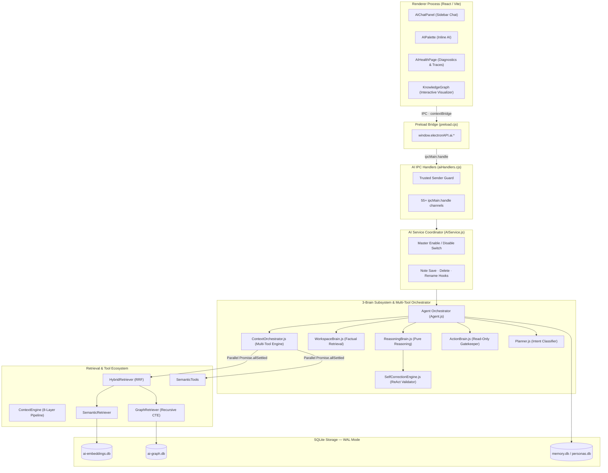

# AI Subsystem & Multi-Tool Orchestration Architecture

Notely implements a local-first, offline-ready AI architecture designed for privacy, low latency, multi-tool evidence orchestration, and deterministic grounding. Markdown notes remain the single source of truth, parsed and indexed into offline-first SQLite databases.

---

## 3-Brain Subsystem & Orchestration Blueprint

The following diagram shows the full request path from React Renderer UI through the ContextOrchestrator, 3-Brain Core, Retrieval Engines, and SQLite Storage Layers.

---

## 1. Multi-Tool Planning & Context Orchestration (`ContextOrchestrator.js`)

The AI behaves like an experienced researcher gathering sufficient evidence before answering:

* **Intent Understanding & Planning**: `Planner.js` creates internal retrieval plans (`DirectQuery`, `TopicExploration`, `TimelineReconstruction`, `TaskSummary`) without exposing planning details to the user.
* **Concurrent Tool Execution**: Independent candidate tools (`find_discussions`, `explore_topic_graph`, `find_architecture`) run concurrently using `Promise.allSettled`.
* **Dynamic Tool Output Chaining**: Tool outputs chain into subsequent retrieval steps (e.g. note paths $\rightarrow$ graph expansion $\rightarrow$ timeline).
* **Context Aggregation & Deduplication**: Consolidates evidence, eliminates duplicate snippets, ranks importance, and attaches source note link attributions (`[file.md](file:///path)`).
* **Confidence Evaluation Loop**: Measures overall evidence confidence ($0.0 - 1.0$). If confidence $< 0.70$, performs additional graph or discussion retrieval steps before handoff to `ReasoningBrain.js`.
* **Diagnostic Trace Telemetry**: Records all tool calls, graph traversals, and outputs into `executionTrace`, which is passed to the UI **AI Health & Diagnostics** page (`AIHealthPage.jsx`).

---

## 2. The 3-Brain Architectural Triad

1. **WorkspaceBrain (`WorkspaceBrain.js`)**: Proactively gathers active note text, vector similarity matches, and graph hops into a normalized evidence payload.
2. **ReasoningBrain (`ReasoningBrain.js`)**: Synthesizes natural human responses from curated evidence. Possesses zero direct storage or filesystem dependencies.
3. **ActionBrain (`ActionBrain.js`)**: Acts as a strict permission gatekeeper. Permanently blocks `update_note`, `delete_note`, `move_note`, `rename_note` and prevents overwriting existing notes on `create_note`.

---

## 3. Grounding & ReAct Self-Correction Engine

1. **`GroundingEngine.js`**: Audits `[label](file:///path)` markdown citations against local disk. If a link target does not exist, converts the citation to a plain text title label.
2. **`SelfCorrectionEngine.js`**: Intercepts draft responses before emitting output, stripping technical tool narration jargon (e.g. *"I executed search_notes"*).

---

## 4. Test Suite Verification

Covered by Vitest test suites under `tests/ai/` (27 test files / 72 tests passing 100%):
* `tests/ai/orchestrator.spec.js`: Multi-tool planning, parallel retrieval, and evidence aggregation tests.
* `tests/ai/brainTriad.spec.js`: 3-Brain isolation & note immutability tests.
* `tests/ai/selfCorrection.spec.js`: ReAct validation pass & zero-jargon gate tests.
* `tests/ai/knowledgeGraph.spec.js`: Knowledge Graph recursive CTE & UTC date matching tests.
