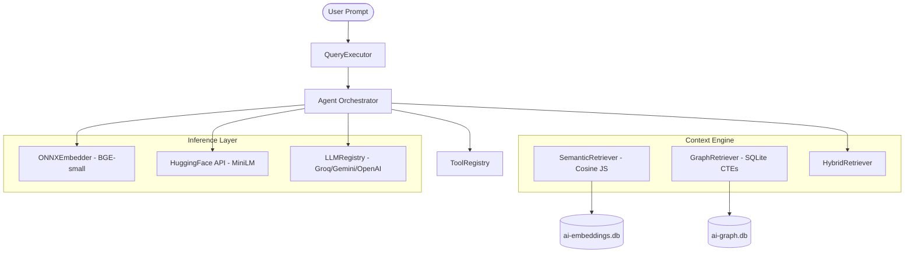

# AI Subsystem Architecture

Notely implements a local-first, offline-ready AI architecture designed for privacy and low latency. This document outlines the internals of the embedding indexer, the knowledge graph, and the query execution lifecycle.

---

## Architecture Blueprint



---

## 1. Vector Embeddings Engine

Instead of utilizing heavy native SQLite vector extensions (which introduce cross-compilation complexity in Electron apps), Notely implements a high-performance hybrid pipeline:

### Storage Schema
Embeddings are stored in `{workspace}/.notes-app/ai-embeddings.db` using standard SQLite tables:
* **`chunks`**: Text blocks, file paths, line numbers, hashes, and embedding vectors (saved as standard binary `BLOB` fields).
* **`note_hashes`**: Track files to identify updates/deletions.
* **`indexing_queue`**: Background pipeline jobs.

### Dimension Guard
* **Model Validation**: The database tracks the active `embedding_model` for all cached chunks. To prevent similarity comparison errors from varying vector sizes, the system runs `verifyModelDimensions(activeModelName)` on boot and worker startup. If a model change is detected, it clears the `chunks` database to trigger a clean rebuild.

### Extraction & Query Process
1. **Model Execution**: A local ONNX session (via `onnxruntime-node` or `onnxruntime-web`) executes `BGE-small-en-v1.5` to generate 384-dimensional vectors. Alternatively, the cloud HuggingFace Inference API (`sentence-transformers/all-MiniLM-L6-v2`) is used.
2. **Tokenizer Fallback**: If the ONNX runtime is missing, the system utilizes a robust pre-tokenization pattern (`/[a-z0-9]+|[^\s\w]/gi`) in `ONNXEmbedder.js` to preserve punctuation, formatting marks, and mathematical symbols as individual tokens instead of stripping them.
3. **Batch Retrieval & Cosine JS**: During a semantic search query, the `SemanticRetriever` pulls chunk vector `BLOB`s in batches (default: 500) from the SQLite database and performs standard binary buffer deserialization into Javascript `Float32Array` collections. The similarity calculation is run using a fast in-memory Javascript cosine similarity loop.
4. **Keyword Fallback**: If the local embedding provider is uninitialized or vector generation fails, `SemanticRetriever` falls back to a plain-text SQL `LIKE` query (`searchTextFallback`) against the chunk content.
5. **Filtering**: Matches are filtered using a threshold ($\ge 0.70$), sorted, and deduplicated. Note contents are only loaded from the database for the top-scoring matches.

---

## 2. Knowledge Graph Subsystem

Notely maps relationships between note documents inside `{workspace}/.notes-app/ai-graph.db`.

### Graph Structure
* **`entities`**: Nodes representing markdown notes, tags, people (`@mentions`), and specific concepts. The note's entity ID is derived directly from slugifying its filename (e.g. `AI and Search.md` -> `ai-and-search`).
* **`relationships`**: Directed edges (`source_id` $\rightarrow$ `target_id`) representing links, mentions, or thematic clusters.

### Synchronization & Deletion
* **Entity Cleanup**: When a note is deleted, `AIService` triggers `deleteNoteEntityAndRelationships(notePath)` in `GraphDB.js`. This runs a transaction to synchronously purge all incoming/outgoing edges (`source_id` or `target_id` matching the slugified `entityId`) and the note's entity node itself, avoiding orphaned nodes and stale link suggestions.

### Graph Traversals via Recursive CTEs
Because the graph database is backed by standard SQLite, relation traversals and pathfinding are performed using native **Recursive Common Table Expressions (CTEs)**. This removes the need for custom graph query engines:

#### Depth-First Neighbor Search
To discover associated nodes up to depth $N$:
```sql
WITH RECURSIVE connected(id, depth) AS (
  SELECT ? as id, 0 as depth
  UNION
  SELECT r.target_id, c.depth + 1
  FROM relationships r JOIN connected c ON r.source_id = c.id
  WHERE c.depth < ?
  UNION
  SELECT r.source_id, c.depth + 1
  FROM relationships r JOIN connected c ON r.target_id = c.id
  WHERE c.depth < ?
)
SELECT DISTINCT e.*, c.depth 
FROM entities e 
JOIN connected c ON e.id = c.id;
```

#### Pathfinding
To find the shortest link path between two notes:
```sql
WITH RECURSIVE paths(id, path_str, depth) AS (
  SELECT ? as id, ? as path_str, 0 as depth
  UNION ALL
  SELECT r.target_id, p.path_str || ',' || r.target_id, p.depth + 1
  FROM relationships r JOIN paths p ON r.source_id = p.id
  WHERE p.depth < ? AND p.path_str NOT LIKE '%' || r.target_id || '%'
)
SELECT path_str FROM paths WHERE id = ? ORDER BY depth ASC LIMIT 1;
```

---

## 3. Query Execution Lifecycle

When you ask a question to the Notely AI Agent:

1. **Context Construction**: `ContextEngine` fetches conversational history, the active note's contents, semantic chunks via `SemanticRetriever`, and neighbors via `GraphRetriever`.
2. **Tool Loading**: The system reads available tools from the `ToolRegistry`, including:
   * Core Note Operations: `read_note` (capped to 10,000 characters with `start_line` and `end_line` pagination parameters), `list_notes`, `search_notes`.
   * Advanced Operations: `resolve_folder_link` (resolves relative subdirectory paths), `read_pdf` (plain text extractor via `pdfjs-dist`).
   * Version Control: `git_diff` and `git_commit` (inspect unstaged changes and commit them).
3. **SDK Routing**: The request is dispatched to the active provider (Gemini, Groq, or OpenAI compatible) using the **Vercel AI SDK** with `maxSteps: 5`.
4. **Execution Loop**: The LLM executes tool calls if needed, receives feedback, and returns a natural language response.
5. **Memory Record**: The prompt, response, tokens used, and tool trace are saved to the history database.
