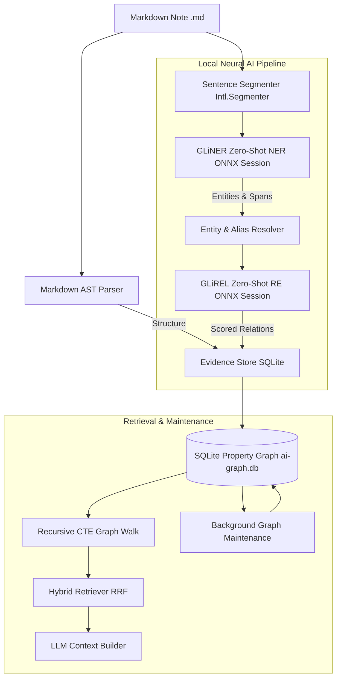
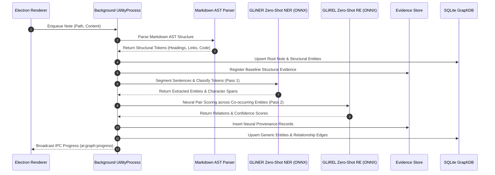
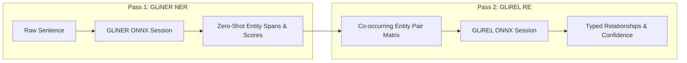
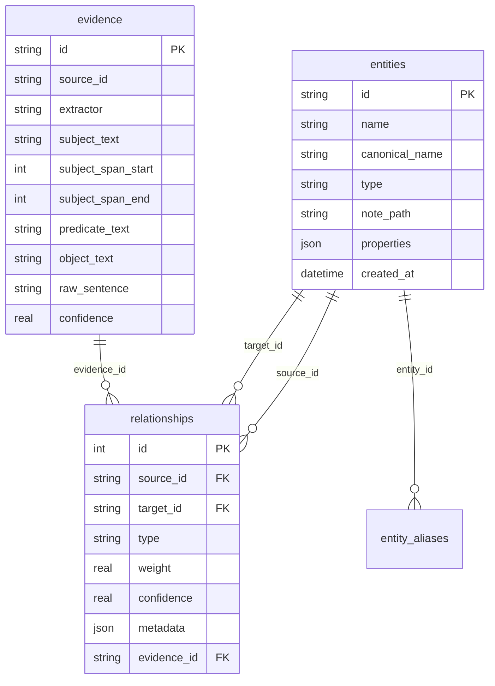
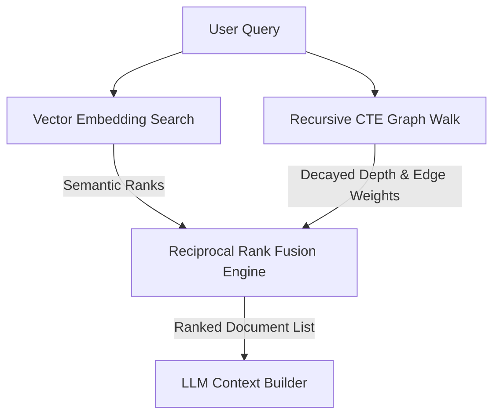

# Knowledge Graph Generation Engine

Notely features an offline, local-first, AI-powered **Knowledge Graph Generation Engine**. It operates without any cloud dependencies, transforming raw Markdown notes into an interconnected Property Graph using local ONNX neural models, SQLite storage, and hybrid GraphRAG retrieval.

---

## Architecture Overview

The system uses a multi-tier pipeline separating document structure parsing from neural semantic understanding.

---

## Detailed Pipeline Flow

Processing a Markdown document follows a deterministic, non-blocking pipeline inside an isolated Electron `utilityProcess` worker process.

---

## Key Components & Concepts

### 1. Markdown AST Parser (Structure & Metadata)

The structural parser converts raw Markdown text into a structural AST tree without imposing domain semantics.

- **Root Note Entity**: Uniquely identifies the document by path hash.
- **Frontmatter & Header Key-Value Metadata**: Automatically extracts YAML block frontmatter and top key-value lines (`Tags:`, `Name:`, `Location:`, `Time:`):
  - `Tags:` / `- tag` $\rightarrow$ Generates `#tag` (`Tag`) nodes linked to Note.
  - `Name: Person A, Person B` $\rightarrow$ Generates `Person` entities linked via `has_person`.
  - `Location: City` $\rightarrow$ Generates `Location` entities linked via `located_in`.
  - `Time: DateRange` $\rightarrow$ Preserved in `Note.properties.metadata`.
- **Wikilinks (`[[Target]]`)**: Links documents to target notes with bidirectional edge weights.
- **Section Headings (`# Heading`)**: Captures document hierarchy (`contains_section`) with level-attenuated weights ($H_1 = 1.4, H_2 = 1.3, \dots, H_6 = 0.9$). Built-in Notely system sections (`# RawNotes`, `# Cleansed`) are automatically excluded from becoming section nodes.
- **Tags (`#tag`)**: Categorizes concepts (`tagged`).
- **Code Blocks & Snippets**: Identifies code snippets and languages (`contains_code`, `references_code`).
- **Tasks (`- [ ]`, `- [x]`)**: Extracts open (`has_open_task`) and completed (`has_completed_task`) task items.
- **Callouts & Math Formulas**: Preserves structural metadata for callout blocks and math syntax ($math$).

> [!TIP] **Global Single-Node Deduplication**
> Entities and structural nodes (e.g. `CodeBlock: JS`, `Tag: #research`, AI-extracted entities) use deterministic SHA-256 ID resolution. If **Note A** and **Note B** both reference `JS`, the engine creates **only one single global block/node** for `JS`, linking both notes to that shared node as hubs in the graph network.

---

### 2. Specialist Neural Extraction Pipeline

Semantic extraction uses two offline ONNX models (~70MB each) executing via local ONNX runtime (`onnxruntime-node`).

1. **Pass 1 — Named Entity Recognition (NER)**:
   Segments document using `Intl.Segmenter` and runs zero-shot GLiNER ONNX session to locate entities with confidence scores $\ge 0.50$. Dynamically maps candidates to standard entity categories (`Person`, `Organization`, `Technology`, `Location`, `Concept`, `Product`, `Event`, `Document`, `Diagram`, `Task`) without hardcoded taxonomies or word lists, preserving complete domain independence across engineering, medicine, finance, and law.
2. **Pass 2 — Relation Extraction (RE)**:
   Evaluates co-occurring entity pairs within sentence windows, running zero-shot GLiREL ONNX relation classification tensors to score edge connection strength (`depends_on`, `uses`, `created_by`, `contains`, `is_a`, `related_to`).

---

### 3. SQLite Property Graph & Evidence Store

Knowledge graph data is stored locally in `.notes-app/ai-graph.db` using native SQLite (`node:sqlite`) with Write-Ahead Logging (`PRAGMA journal_mode = WAL;`).

- **Deterministic Entities**: Entity IDs are generated deterministically using SHA-256 (`ent-` + sha256 of type:normalizedName).
- **Evidence & Provenance**: Every AI-discovered relationship links to an `evidence` record preserving exact source offsets, raw sentence text, extractor identity, and confidence score.

---

### 4. Entity Resolution & Canonicalization

Entity names and variations are resolved using a hybrid distance calculation:

$$\text{Similarity}(s_1, s_2) = \max\left( \text{LevenshteinSim}(s_1, s_2), \text{JaccardTokenSim}(s_1, s_2) \right)$$

Candidate matches above threshold $\ge 0.88$ are automatically mapped in `entity_aliases` table without mutating source entity IDs.

---

### 5. Hybrid GraphRAG & RRF Retrieval

Retrieval combines semantic vector search with recursive GraphRAG multi-hop walks using **Reciprocal Rank Fusion (RRF)**:

$$\text{RRF\_Score}(d) = \frac{1}{k + \text{Rank}_{\text{vector}}(d)} + \frac{1 + \alpha \cdot W_{\text{graph}}(d)}{k + \text{Rank}_{\text{graph}}(d)}$$

Where:
- $k = 60$ (standard RRF constant)
- $\alpha = 0.25$ (graph weight bonus multiplier)
- $W_{\text{graph}}(d)$ is the accumulated edge weight with depth decay ($1 / (1 + \text{depth})$)

---

### 6. Self-Healing Background Maintenance

When the background job queue drains, `GraphMaintenance` runs incremental cleanup tasks:

1. **Orphan Purging**: Deletes orphan non-note entities with zero connections.
2. **Stale Edge Decay**: Applies decay factor ($W \times 0.95$) to relationships older than 30 days.
3. **Alias Deduplication**: Merges candidate duplicate entity mentions using hybrid string similarity.
