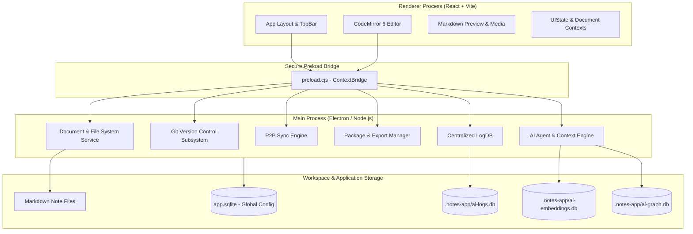
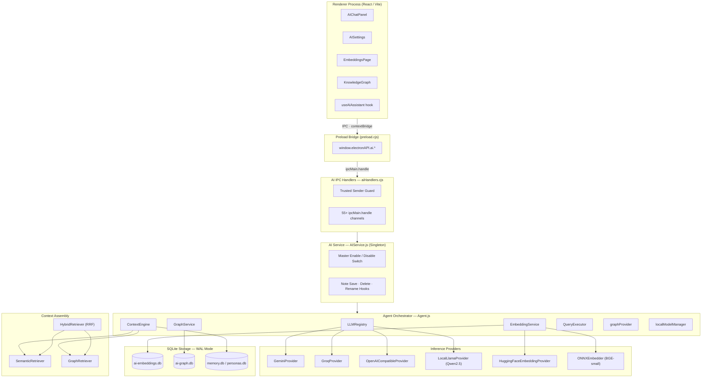
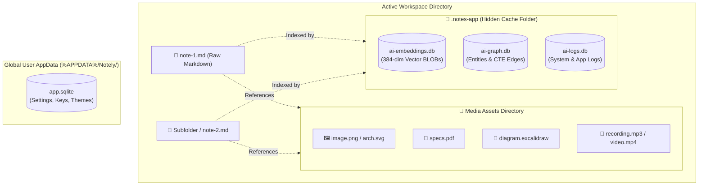

# Notely Application Architecture

Notely is an offline-first, local-first markdown note-taking and knowledge management application built using **Electron**, **React**, **CodeMirror 6**, and **Node.js**.

---

## 1. High-Level Architecture Overview

Notely separates execution between a sandboxed **Renderer Process** (React UI) and a privileged **Main Process** (Node.js backend) communicating via secure IPC channels.



---

## 2. Renderer Layer (React & Editor Architecture)

The user interface is powered by React 18, Vite, and custom CSS variables supporting dynamic light/dark mode themes.

### Component Structure
* **App Shell (`App.jsx`)**: Manages primary navigation, view routing, full-screen page overlays (`KnowledgeGraph`, `EmbeddingsPage`, `AppLogsPage`, `AIPersonasManager`, `AIHealthPage`, `GitVC`), and footer status bar.
* **Layout Engine (`LandingView.jsx`, `EditorPane.jsx`, `DocumentDetail.jsx`)**: Responsive split-pane layout supporting Edit mode, Preview mode, and Live Split View.
* **Editor Core (`CodeMirrorEditor.jsx`, `MarkdownEditor.jsx`)**: Built on CodeMirror 6 with custom extensions for syntax highlighting, line numbers, block folding, spell-checking, search/replace, and hotkeys.
* **Preview Renderer (`MarkdownPreview.jsx`)**: Full GitHub-Flavored Markdown (GFM) renderer supporting LaTeX equations (`katex`), task lists, local media resolution, and Wikilink navigation (`[[Note]]`).
* **Mermaid.js Integration**: Real-time evaluation and SVG rendering of GFM code blocks (```` ```mermaid ````) for flowcharts, sequence diagrams, class diagrams, Gantt charts, and mindmaps across preview mode, split view, and exported documents.
* **Excalidraw Drawing Editor**: Embedded interactive whiteboard component allowing users to sketch visual diagrams, hand-drawn wireframes, and architectural schematics. Drawings are persisted as human-readable `.excalidraw` JSON files or embedded SVG graphics inside workspace notes.

### State Management & Contexts
* **`UIStateContext.jsx`**: Controls global dialogs, sidebar panels, active full-screen pages, theme preferences, and zoom factors.
* **`DocumentContext.jsx`**: Tracks the open document list, active document handle, unsaved dirty states, file content buffers, and document metadata.

---

## 3. Main Process & Application Subsystems

The Electron main process (`electron/main.cjs` & `electron/lib/`) coordinates application logic across core subsystems:

### A. Document & File System Service
* **File Watcher (`chokidar`)**: Watches workspace directory tree recursively for external file additions, edits, renames, and deletions.
* **Subfolder & Path Traversal**: Resolves relative note paths, handles file CRUD operations safely, and computes workspace-wide document statistics.

### B. Git Version Control Subsystem (`gitService.cjs`)
* **Local Git Execution**: Runs native `git` CLI commands synchronously or asynchronously without external cloud dependencies.
* **Feature Set**: Workspace initialization, status tracking (staged/unstaged files), diff generation, commit creation, branch management, and commit history inspection.

### C. P2P Local Sync Engine (`p2pService.cjs`)
* **Peer Discovery**: Discovers local network peers for direct device-to-device note synchronization.
* **Status Snapshots**: Tracks live peer connection states and sync progress.

### D. Package, Import & Export Subsystem (`notePackageIpc.cjs`)

**Document Exporters**:
* Exports individual markdown notes to **HTML** and **PDF** formats via Headless Chromium rendering (CSS theme applied, media resolved).

**Note Package System** (`.note` bundle format):
* Bundles selected `.md` files with all linked assets into a single portable `.note` file via **File → Export / Import Note Package**.
* **Bundled assets**: markdown files, `media/images/`, Excalidraw diagrams (`.notes-app/excali-diagrams/`), Draw.io diagrams (`media/draw.io/`), and auto-generated `metadata.json`.
* **Security**: AES-256 encrypted bundle (not readable by generic ZIP tools). Each file is SHA-256 hashed and verified on import to reject tampered packages. Optional password protection stores a salted SHA-256 signature in the manifest.
* **Import**: Decrypts and verifies bundle integrity, resolves asset path conflicts, and places all files into the active workspace. See [Export & Import Reference](/export-reference) for full user-facing documentation.

### E. AI & Context Engine Subsystem (`aiService.cjs`)
* **Vector Embeddings Engine (`EmbeddingDB.js`)**: Stores 384-dimensional `BGE-small` vector chunks in `{workspace}/.notes-app/ai-embeddings.db`. Features physical vector dimension validation (`verifyModelDimensions`) to prevent dimension mismatches.
* **Knowledge Graph Subsystem (`GraphService.js`, `GraphDB.js`)**: Maps note relations, tags, mentions, Wikilinks, Images, Local Documents, and External URLs in `{workspace}/.notes-app/ai-graph.db`. Executes relation traversals via SQLite **Recursive Common Table Expressions (CTEs)**.
* **Agent & Tool Orchestration**: Integrates with a local embedding runtime and cloud LLMs (Gemini, Groq, OpenAI) using the Vercel AI SDK.
* **Local GGUF Engines**: Supports local text generation and offline graph extraction via `node-llama-cpp`. `LocalModelManager` handles shared runtime loads of the Qwen GGUF model to prevent CPU/RAM overheads.

#### AI Layer Architecture

The following diagram shows the full request path from the React UI through each layer to inference and storage:



For a detailed walkthrough of each layer, see [AI Subsystem Architecture](/ai/architecture).

---

## 4. Centralized System Logging Infrastructure (`LogDB.js`)

Logging across Notely is managed by a centralized, generic SQLite log store (`LogDB.js`).

### Database Schema
Logs are persisted inside the active workspace directory at `{workspace}/.notes-app/ai-logs.db`:

```sql
CREATE TABLE IF NOT EXISTS logs (
  id INTEGER PRIMARY KEY AUTOINCREMENT,
  subsystem TEXT NOT NULL,
  level TEXT DEFAULT 'info',
  message TEXT NOT NULL,
  metadata TEXT,
  timestamp TEXT NOT NULL
);
CREATE INDEX IF NOT EXISTS idx_logs_subsystem ON logs(subsystem);
```

### Log Subsystem Categories
* **`app`**: Application startup, settings updates, file system I/O, package import/export.
* **`git`**: Git status checks, staging, commits, diffs, branch operations.
* **`embeddings`**: Vector indexing pipeline, model loading, chunking, database updates.
* **`graph`**: Knowledge Graph entity extractions, relationship linking, graph rebuilds.
* **`ai`**: LLM queries, tool invocations, prompt context assembly.

### User Diagnostics & Management UI
* **System Logs Console (`AppLogsPage.jsx`)**: Accessible via **Help -> System & Application Logs**. Features live search, subsystem/severity dropdown filters, live auto-refresh toggle, log clearing, and JSON log export.
* **Subsystem Log Feeds**: Embedded log panels inside `EmbeddingsPage` and `KnowledgeGraph` display real-time subsystem-filtered events.
* **Subsystem Data Clear Buttons**: `EmbeddingsPage` features a **Clear Embeddings Data** button (`aiClearEmbeddingsData`), and `KnowledgeGraph` features a **Clear Knowledge Graph Data** button (`aiClearGraphData`) to clear data caches independently of logs.

---

## 5. Data Storage & Workspace Directory Structure

Notely maintains a clean separation between global application config, human-readable workspace files, and local metadata caches:

### Workspace Storage Diagram



### Global Configuration
* **Global App Database (`%APPDATA%/Notely/app.sqlite`)**: Manages user preferences, API keys, active themes, window dimensions, P2P sync pairs, and recently opened workspaces.

### Workspace File Structure
* **Raw `.md` Files**: Notes are saved as plain-text UTF-8 Markdown files directly in workspace root and subdirectories (`{workspace}/**/*.md`). Notely imposes zero proprietary database wrapping or lock-in, enabling seamless external editing with Git, VS Code, or Obsidian.
* **`Media/` Assets Folder**: A dedicated assets directory located at `{workspace}/Media/` created to house user-attached media files:
  * Images (`.png`, `.jpg`, `.jpeg`, `.gif`, `.svg`, `.webp`).
  * Video & Audio recordings (`.mp4`, `.webm`, `.mp3`, `.wav`, `.m4a`).
  * Document attachments (`.pdf`).
  * Excalidraw drawing files (`.excalidraw`).
* **Hidden Subsystem Folder (`{workspace}/.notes-app/`)**: Internal SQLite caches for AI and system features:
  * `ai-embeddings.db`: Stores chunk text, line offsets, hashes, and 384-dimensional binary vector `BLOB`s.
  * `ai-graph.db`: Stores extracted Knowledge Graph entity nodes, Wikilinks, media links, and relationship edges.
  * `ai-logs.db`: Stores multitenant application, git, embedding, graph, and AI log entries.
