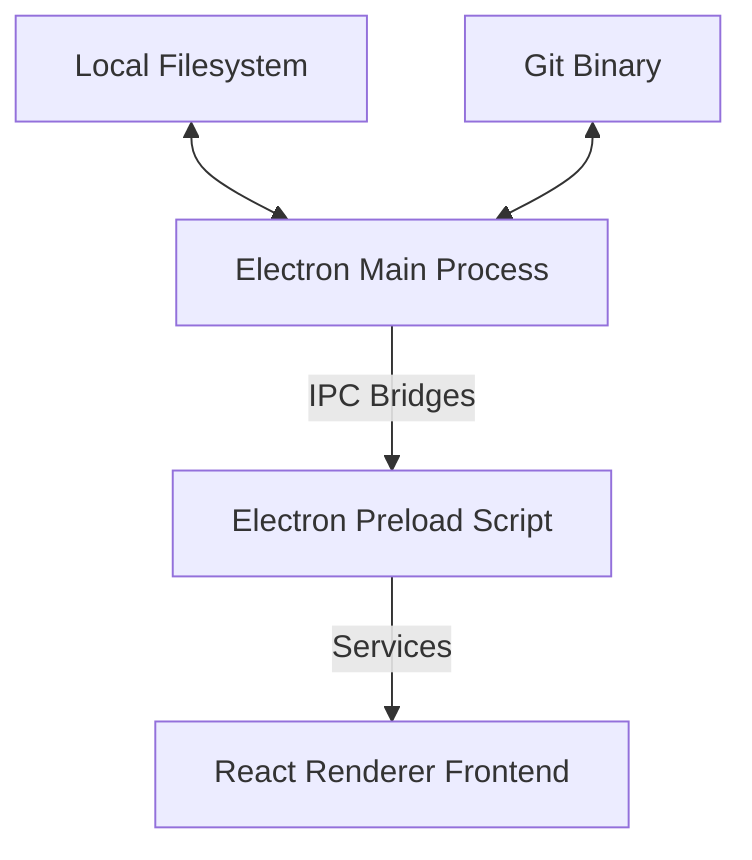

# Developer Documentation

Notely is built with Electron, React, and Vite.

## Architecture

- **Main Process (`electron/main.cjs`)**: Handles system calls, window lifecycle, local file input/output, Git operations via `simple-git`, and local network pairing processes.
- **Preload (`electron/preload.cjs`)**: Exposes structured API handles safely to the renderer context using `contextBridge`.
- **Renderer (`src/`)**: Built using React, CodeMirror for the editor canvas, and Lucide for icons.

---

## Build Tasks

- **`npm run dev`**: Starts Vite dev server and runs the Electron wrapper.
- **`npm run build`**: Compiles assets for distribution.
- **`npm run docs:dev`**: Launch VitePress development site.
- **`npm run docs:build`**: Builds the static documentation site.
