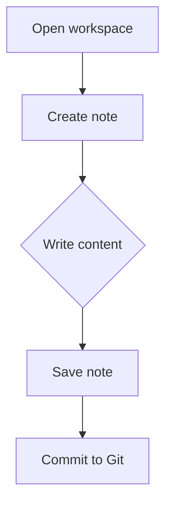
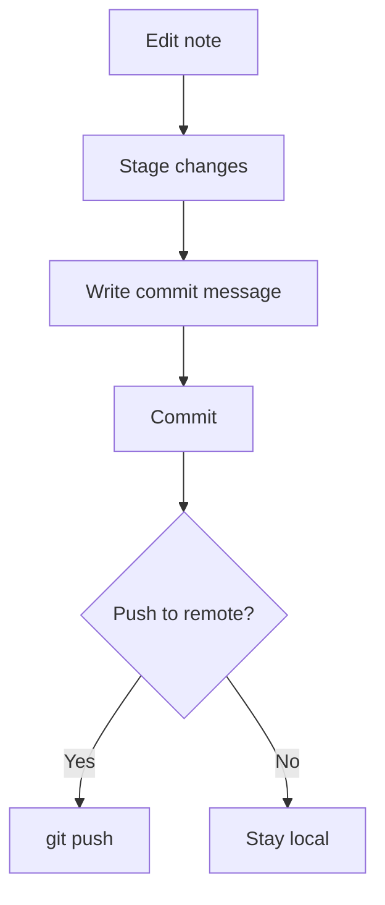

# Diagrams

Notely supports two diagram formats: **Mermaid** for text-based diagrams written in code, and **Excalidraw** for freehand whiteboard-style drawing.

## Mermaid Diagrams

[Mermaid](https://mermaid.js.org/) lets you create diagrams using a simple text syntax. Notely renders them live in Preview and Split modes.

### Insert a Mermaid Block

1. In Edit mode, click **Diagram → Mermaid** in the toolbar.
2. A Mermaid code block is inserted at the cursor.
3. Write your Mermaid syntax inside the block.
4. Switch to Split or Preview to see the rendered diagram.

### Diagram Types

````markdown

````

| Type | Keyword | Use for |
|---|---|---|
| Flowchart | `graph TD` / `graph LR` | Processes, decisions, flows |
| Sequence | `sequenceDiagram` | API calls, user interactions |
| Gantt | `gantt` | Project timelines |
| Class | `classDiagram` | Object relationships |
| State | `stateDiagram-v2` | State machines |
| ER | `erDiagram` | Database schemas |
| Pie | `pie` | Data proportions |

### Example — Git Workflow



### Troubleshooting Mermaid

If your diagram does not render:
1. Switch to Split mode to see both the source and the error message.
2. Check for syntax errors — Mermaid is strict about arrow direction (`-->` not `→`).
3. Validate with the [Mermaid Live Editor](https://mermaid.live/).

---

## Excalidraw Diagrams

[Excalidraw](https://excalidraw.com/) provides a whiteboard canvas for freehand drawing, annotated shapes, and visual diagrams embedded directly in your notes.

### Insert an Excalidraw Diagram

1. Click **Diagram → Excalidraw** in the toolbar.
2. An Excalidraw block is inserted in the note.
3. In Preview mode, the Excalidraw canvas opens.
4. Draw your diagram, then click **Save** to embed it.
5. The diagram is stored as a file in your workspace.

### Re-Edit an Existing Diagram

1. In Preview mode, click the **Edit** button on the Excalidraw preview.
2. The canvas reopens with your existing drawing.
3. Make changes, then click **Save**.

### Convert an Image to Excalidraw

You can convert any workspace image into an Excalidraw diagram so you can annotate or draw on top of it:

1. In Preview mode, right-click on any workspace image.
2. Select **Edit with Excalidraw**.
3. The image is placed on the Excalidraw canvas as a resizable background element.
4. Draw annotations, arrows, or labels on top.
5. Click **Save** to replace the image reference with the Excalidraw diagram.

### Restore the Original Image

If you converted an image to Excalidraw and want to revert to the original:

1. In Preview mode, right-click the Excalidraw preview.
2. Select **Restore original image**.

::: info Restore Availability
The **Restore original image** option only appears for Excalidraw diagrams that were created from an image conversion. Diagrams created from scratch do not show this option.
:::

---

## Choosing Between Mermaid and Excalidraw

| | Mermaid | Excalidraw |
|---|---|---|
| **Best for** | Technical diagrams, flows, schemas | Freehand sketches, annotations |
| **Editing** | Text syntax | Visual canvas |
| **Version control** | Full diff support (text) | Binary file storage |
| **Offline** | ✓ | ✓ |
