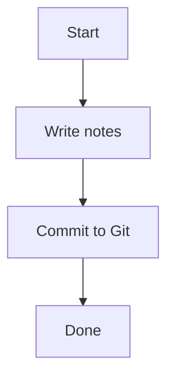

# Markdown Guide

Notely renders [GitHub Flavored Markdown (GFM)](https://github.github.com/gfm/). This page covers the complete syntax supported by the editor.

## Headings

```markdown
# Heading 1
## Heading 2
### Heading 3
#### Heading 4
##### Heading 5
###### Heading 6
```

::: tip Heading Hierarchy
Use a single `# H1` per note (the note title). Start sections at `## H2`. Screen readers and the Outline panel use heading structure to navigate.
:::

## Text Formatting

| Format | Syntax | Result |
|---|---|---|
| Bold | `**bold**` or `__bold__` | **bold** |
| Italic | `*italic*` or `_italic_` | *italic* |
| Bold + Italic | `***both***` | ***both*** |
| Strikethrough | `~~strike~~` | ~~strike~~ |
| Inline code | `` `code` `` | `code` |

## Paragraphs and Line Breaks

Leave a blank line between paragraphs:

```markdown
First paragraph.

Second paragraph.
```

For a line break without a new paragraph, add two spaces at the end of the line or use `\`:

```markdown
Line one  
Line two
```

## Lists

### Unordered

```markdown
- Item one
- Item two
  - Nested item
  - Another nested item
- Item three
```

### Ordered

```markdown
1. First step
2. Second step
3. Third step
```

### Task Lists

```markdown
- [ ] Open task
- [x] Completed task
- [ ] Another open task
```

Rendered task checkboxes are interactive in Preview mode — click to toggle state (changes are written back to the Markdown source).

## Links

```markdown
[Link text](https://example.com)
[Link with title](https://example.com "Hover title")
[Relative link to another note](./other-note.md)
```

## Images

```markdown


```

Use the toolbar **Image** button to pick a file from your workspace — Notely handles the path automatically.

## Blockquotes

```markdown
> This is a blockquote.
> 
> It can span multiple paragraphs.

> Nested:
>> Inner quote
```

## Code Blocks

Fenced code blocks with syntax highlighting:

````markdown
```javascript
function greet(name) {
  return `Hello, ${name}!`;
}
```
````

Supported languages include: `js`, `ts`, `jsx`, `tsx`, `python`, `rust`, `go`, `sql`, `bash`, `css`, `html`, `json`, `yaml`, `markdown`, and [many more](https://highlightjs.org/).

→ [Code Blocks — full guide](/editor/code-blocks)

## Tables

```markdown
| Column A | Column B | Column C |
|---|---|---|
| Row 1 | Data | Data |
| Row 2 | Data | Data |
```

Column alignment:

```markdown
| Left | Center | Right |
|:---|:---:|---:|
| left | center | right |
```

::: tip Inline Table Editor
Click inside any table in the editor to open the inline table editor overlay for a spreadsheet-style editing experience.
:::

→ [Tables — full guide](/editor/tables)

## Horizontal Rules

```markdown
---
```

or

```markdown
***
```

## Footnotes

```markdown
This is a sentence with a footnote.[^1]

[^1]: Here is the footnote text.
```

## HTML

Notely renders inline HTML in Preview mode when safe HTML is enabled. Use sparingly.

```markdown
<details>
<summary>Click to expand</summary>
Hidden content here.
</details>
```

## Escape Characters

Prefix any Markdown character with a backslash to render it literally:

```markdown
\# Not a heading
\*Not italic\*
\`Not code\`
```

## Mermaid Diagrams

Embed flowcharts, sequence diagrams, Gantt charts, and more:

````markdown

````

→ [Diagrams — full guide](/editor/diagrams)
