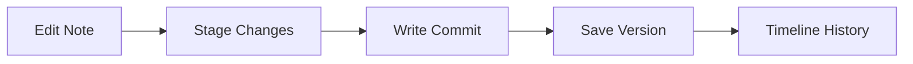

# Git Version Control

Notely features a native, Git-backed version control system to track document changes. Every modification can be versioned, compared, and restored without relying on external Git tools.

## Why Git?

Using Git directly under the hood ensures:
- **Portability**: Your note history is stored in standard Git format, meaning you can open the folder in any Git client (like GitHub Desktop or VS Code) to view the history.
- **Precision**: Fine-grained line-by-line diffs of changes.
- **Safety**: Rollback individual files or entire folders to a previous point in time.
